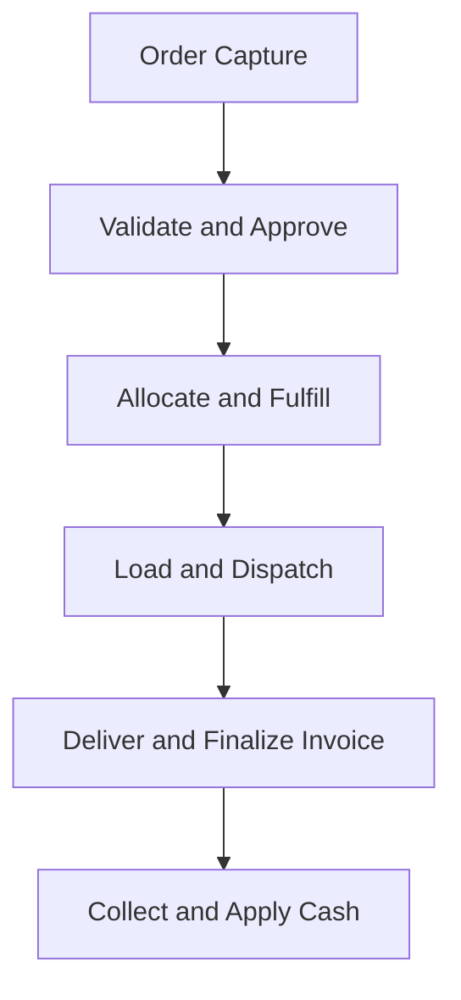
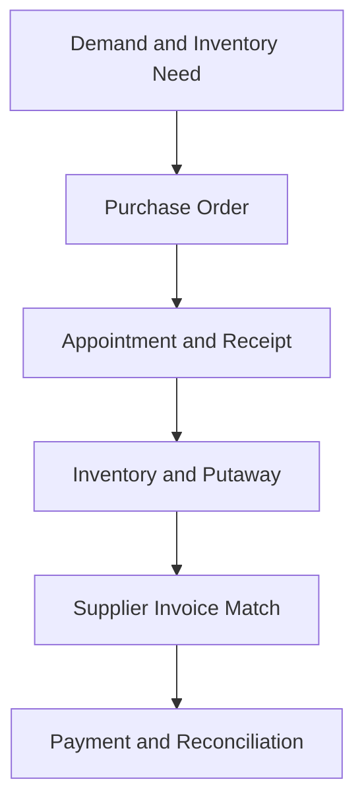

# Business Process and Transaction Lifecycle Specification

**Document date:** September 4, 2026  
**Document status:** Authoritative process and transaction-lifecycle specification  
**Governing documents:**

- `Business_Model_and_Operating_Policies.md`
- `Business_to_IT_Capability_Specification.md`
- `Information_Model_and_Record_Ownership_Specification.md`

---

## 1. Purpose

This document defines how work moves through \<business name> from initiation through completion, including:

- Business actors
- Preconditions
- Process steps
- Records created or changed
- Validations and approvals
- Departmental handoffs
- Exceptions and recovery paths
- Accounting consequences
- Completion and reconciliation criteria

This document describes business behavior. It does not prescribe C++ classes, physical file formats, index structures, screens, or hardware.

---

## 2. Process Design Principles

### 2.1 A transaction has one business identity

Each order, purchase order, receipt, delivery, invoice, payment, payroll run, journal, and other controlled transaction receives one permanent identity used throughout its lifecycle.

### 2.2 Status is explicit

Every controlled transaction has a defined status. A transaction cannot silently move from one stage to another.

### 2.3 Handoffs are acknowledged

When responsibility moves between departments, the receiving function must be able to identify:

- What was received
- When it was received
- Its current status
- What action is required
- What exceptions already exist

### 2.4 Operational and accounting completion are linked

A process is not fully complete until required operational records, financial consequences, exception resolution, and reconciliation evidence exist.

### 2.5 Reprocessing is safe

Restarting or retrying a step must not duplicate inventory, receivables, payables, cash, payroll, or journal effects.

### 2.6 Exceptions remain visible

An unresolved hold, shortage, mismatch, quality problem, delivery failure, overdue item, or accounting difference remains assigned and visible until resolved or formally closed.

### 2.7 Overnight work retains its business cycle

Calendar midnight does not create a new fulfillment cycle. Monday-night picking after midnight remains associated with the Monday order cycle and Tuesday deliveries.

---

## 3. Standard Transaction Control Pattern

All major business transactions follow this general pattern:

```text
Initiated
   -> Validated
   -> Held or Ready
   -> Approved/Released
   -> Executed
   -> Confirmed
   -> Financially Recorded
   -> Reconciled
   -> Closed
```

### 3.1 Required control information

Every controlled transaction retains:

- Permanent transaction number
- Transaction type
- Originating business date and timestamp
- Responsible department and person/process
- Current status
- Status history
- Related master and transaction keys
- Amount and quantity totals when applicable
- Holds and exceptions
- Approval and override history
- Accounting status
- Completion and reconciliation status

### 3.2 Final-state correction

Final transactions are not edited in place. Corrections use:

- Approved change before final completion
- Reversal
- Credit or debit memo
- Inventory adjustment
- Correcting journal entry
- Replacement transaction linked to the original

---

## 4. Business Process Landscape

| Process family | Begins with | Ends with | Primary owner |
|---|---|---|---|
| Customer onboarding | Prospective customer | Active or declined customer | Sales / Finance |
| Customer-to-cash | Customer demand | Applied payment and reconciled AR | Sales / Operations / Finance |
| Replenish-to-pay | Inventory need | Supplier payment and reconciled AP | Purchasing / Operations / Finance |
| Inventory control | Inventory receipt or state change | Accurate quantity, status, and valuation | Operations / Accounting |
| Warehouse fulfillment | Released customer order | Reconciled truck load | Operations |
| Transportation and delivery | Ready truck load | Completed delivery and returned exceptions | Transportation |
| Returns and customer service | Complaint, refusal, or return | Customer, inventory, and financial resolution | Customer Service |
| Food safety and recall | Scheduled control or suspected issue | Verified corrective action and closure | Operations |
| Employee-to-payroll | Employee and approved work | Paid payroll and reconciled liabilities | Finance / Administration |
| Capital and fixed assets | Approved investment need | Asset in service, financed, depreciated, or disposed | Owners / Finance |
| Record-to-report | Approved business transaction | Closed period and financial statements | Accounting |
| Plan-to-perform | Forecast and strategy | Approved budget, measured result, management action | Owners / Management |

---

## 5. Customer Onboarding Lifecycle

**Process owner:** Authorized Sales management  
**Control owner:** Authorized Finance and Administration management

### 5.1 Preconditions

- A legitimate prospective food-service customer exists within or near the approved service territory.
- Sales has a responsible contact.
- The business has a plausible product and delivery fit.

### 5.2 Normal process

| Step | Responsible actor | Business action | Records | Control/result |
|---:|---|---|---|---|
| ONB-01 | Sales Representative | Identify prospect, segment, locations, and expected needs | Customer in `PROSPECTIVE`; Sales Activity | Duplicate-customer check |
| ONB-02 | Sales | Confirm service territory and commercial fit | Customer Location; delivery requirements | Out-of-territory exception if needed |
| ONB-03 | Customer Service | Capture contacts, order methods, receiving windows, delivery restrictions, preferences | Contact; Location; Delivery Schedule; Preference | Required-information validation |
| ONB-04 | Finance | Obtain legal, billing, tax, and exemption information | Tax Profile; Onboarding Review | Tax evidence verified |
| ONB-05 | Credit | Review requested terms, expected volume, references, and risk | Credit Review; Credit Profile | Conservative opening limit assigned |
| ONB-06 | Sales | Establish salesperson assignment, product needs, delivery frequency, and commercial arrangement | Sales Assignment; Contract/Price records as needed | Pricing authority applied |
| ONB-07 | Operations | Confirm route, receiving window, and delivery feasibility | Delivery Schedule; Route Pattern relationship | Capacity exception if needed |
| ONB-08 | Sales and Finance | Complete independent commercial and credit approvals | Onboarding Review | Both approvals required for credit business |
| ONB-09 | Customer Service | Change Customer to `ACTIVE` and communicate ordering instructions | Customer Status History | Customer becomes transaction-eligible |

### 5.3 Exception outcomes

- `DECLINED_CREDIT`: Customer may be offered prepaid or COD terms.
- `OUTSIDE_TERRITORY`: General Management reviews volume, margin, route cost, and service impact.
- `INCOMPLETE_DOCUMENTATION`: Customer remains in onboarding; credit orders are blocked.
- `ROUTE_CAPACITY_UNAVAILABLE`: Activation may be deferred or delivery schedule changed.
- `UNACCEPTABLE_COMMERCIAL_FIT`: Prospect is closed without activation.

### 5.4 Completion criteria

- Customer and at least one Location are active.
- Sales assignment exists.
- Credit Profile or prepaid/COD rule exists.
- Tax treatment is approved.
- Delivery requirements and normal schedule are defined.
- Applicable prices or contract terms are active.
- Customer can place a valid order.

---

## 6. Customer-to-Cash Overview



The customer-to-cash cycle is the primary operating chain. It must remain traceable from Sales Order through Customer Payment and General Ledger.

---

## 7. Customer Order Capture and Validation

**Process owner before release:** Sales and Customer Service  
**Operational owner after release:** Operations

### 7.1 Initiating conditions

- Customer submits an order through an authorized channel.
- An authorized salesperson enters an order on the customer's behalf.
- A standing order reaches its confirmation point.

### 7.2 Normal process

| Step | Actor | Business action | Records/status | Control/result |
|---:|---|---|---|---|
| CTC-01 | Sales/Customer Service | Identify Customer, Location, contact, requested date, and order type | Sales Order `ENTERED` | Customer/contact/location validation |
| CTC-02 | Sales/Customer Service | Enter Product, selling unit, and quantity | Sales Order Lines `REQUESTED` | Product/unit eligibility |
| CTC-03 | Pricing | Determine effective price, premium, discount, and expected margin | Line `PRICED`; price snapshot | Contract/customer/list precedence |
| CTC-04 | Order Control | Evaluate $500 delivery minimum and applicable charge | Order totals | Charge, combine, or exception |
| CTC-05 | Calendar Control | Evaluate order day, cutoff, delivery schedule, and fulfillment cycle | Scheduled delivery and Fulfillment Cycle | 4:00 PM cutoff; Friday-to-Sunday cycle |
| CTC-06 | Credit | Calculate exposure and validate terms, limit, and holds | Credit decision; possible Order Hold | Sales cannot remove Finance hold |
| CTC-07 | Inventory | Evaluate eligible availability and approved substitutes | Preliminary availability | Held/short/substitute work if insufficient |
| CTC-08 | Transportation | Confirm delivery date, route corridor, receiving window, and capacity | Preliminary route readiness | Capacity conflict raised before release |
| CTC-09 | Order Control | Confirm all required validations | Order `READY` or `HELD` | Every hold has owner and reason |
| CTC-10 | Customer Service | Communicate material exception and obtain customer decision if needed | Case/Activity; Substitution Decision | Customer consent retained |
| CTC-11 | Authorized control owner | Resolve or reject holds and exceptions | Hold released/rejected | Approval and rationale recorded |
| CTC-12 | Customer Service | Release valid order to Operations | Order `RELEASED` | Order becomes controlled warehouse commitment |

### 7.3 Price exceptions

```text
Below-margin line
   -> Sales reviews commercial need
   -> Finance reviews margin and cost
   -> Approved price override or rejected line
   -> Order revalidated
```

### 7.4 Credit exceptions

```text
Exposure exceeds limit or account is held
   -> Credit reviews customer and order
   -> Reject, require payment, temporarily authorize, or release hold
   -> Decision applies only to approved scope
```

### 7.5 Shortage and substitution paths

For an unavailable quantity, Customer Service and Operations may:

1. Use an already approved equivalent.
2. Obtain customer approval for a material substitution.
3. Ship available quantity and create a Backorder.
4. Move the shortage to the next scheduled delivery.
5. Cancel the unavailable quantity with customer notice.

Institutional specifications override general substitution preferences.

### 7.6 Release criteria

An Order may become `RELEASED` only when:

- Customer and Location are eligible.
- Requested Product and unit are valid.
- Applied prices and margin exceptions are approved.
- Credit is approved.
- Delivery minimum is satisfied or resolved.
- Scheduled date and route are feasible.
- Inventory is allocated or shortage resolution is accepted.
- Required customer approvals are recorded.

---

## 8. Inventory Allocation and Order Commitment

**Process owner:** Operations

### 8.1 Normal process

| Step | Actor | Business action | Record effect |
|---:|---|---|---|
| CTC-13 | Inventory Control | Identify eligible Product balances by status, shelf life, and location | Candidate balances |
| CTC-14 | Allocation process | Apply delivery priority, contract obligation, customer priority, fairness, and route feasibility | Inventory Allocation |
| CTC-15 | Allocation process | Apply FEFO to date-controlled Product | Lot/location selection guidance |
| CTC-16 | Inventory Control | Reserve approved quantity against Order Line | Available decreases; allocated increases logically |
| CTC-17 | Inventory Control | Identify unallocated remainder | Shortage/Backorder/Exception |
| CTC-18 | Purchasing | Consume shortage and projected-demand information | Replenishment signal |

### 8.2 Allocation controls

- Held, quarantined, damaged, expired, recalled, and below-minimum-shelf-life inventory is excluded.
- Informal salesperson reservations are prohibited.
- Allocation does not create a physical movement.
- A cancelled or reduced line releases unused allocation.
- Allocation history remains tied to the Order Line.

### 8.3 Allocation completion

An Order is fulfillment-ready when all deliverable quantities are allocated and any shortage resolution is recorded.

---

## 9. Pick-Slot Replenishment

**Process owner:** Warehouse Operations

### 9.1 Planned replenishment

| Step | Actor | Business action | Record effect |
|---:|---|---|---|
| WHF-01 | Warehouse planning | Compare released demand with pick-slot quantity and minimum | Replenishment need |
| WHF-02 | Warehouse planning | Select eligible reserve inventory using FEFO | Replenishment Work `PLANNED` |
| WHF-03 | Second-shift supervisor | Release and assign work | Work `ASSIGNED` |
| WHF-04 | Replenisher | Confirm source pallet/lot and destination pick slot | Work `IN_PROGRESS` |
| WHF-05 | Replenisher | Move quantity | Inventory Movement |
| WHF-06 | Replenisher | Record lot/pallet placement time | Pick-Slot Placement |
| WHF-07 | Supervisor/system control | Confirm quantity and close work | Work `COMPLETED`; balances updated |

### 9.2 Emergency replenishment

If a slot runs short during picking:

1. Pick Work enters `HELD` or `EXCEPTION`.
2. Emergency Replenishment Work is created and prioritized.
3. Eligible reserve stock is moved and placement recorded.
4. Pick Work resumes.
5. The exception is retained for capacity and accuracy analysis.

### 9.3 Controls

- Source and destination must be valid for the Product and storage class.
- FEFO applies unless an authorized reason requires another lot.
- Multiple lots may occupy a slot, but the next lot to deplete remains identifiable.
- Replenishment cannot make held inventory available.

---

## 10. Picking, Staging, and Loading

**Process owner:** Warehouse Operations

### 10.1 Picking

| Step | Actor | Business action | Records/status | Control/result |
|---:|---|---|---|---|
| WHF-08 | Warehouse planning | Group released work by Fulfillment Cycle, route, stop, zone, and priority | Work Batch | Correct operating date retained across midnight |
| WHF-09 | Supervisor | Release and assign Pick Work | Pick Work `ASSIGNED` | Employee and shift recorded |
| WHF-10 | Picker | Go to directed location and select unit/quantity | Pick Work `IN_PROGRESS` | Product, unit, location, FEFO check |
| WHF-11 | Picker | Record actual result | Pick Result | Picked, short, damaged, skipped, substitute |
| WHF-12 | Control/checker | Independently check selected controlled/high-risk items | Check evidence | Split packs and high-error items prioritized |
| WHF-13 | Inventory | Move picked quantity to staged status/location | Inventory Movement | Allocation consumed by actual pick |
| WHF-14 | Warehouse | Resolve pick shortage or exception | Exception resolution | Customer Service notified if commitment changes |

### 10.2 Staging

- Product is staged by route and stop sequence.
- Ambient, refrigerated, frozen, nonfood, damaged, and returned goods remain appropriately separated.
- Staged quantity remains linked to its Order fulfillment.
- Unresolved staging exceptions block load completion.

### 10.3 Loading

| Step | Actor | Business action | Records/status | Control/result |
|---:|---|---|---|---|
| WHF-15 | Warehouse/Dispatch | Confirm Truck, compartments, Route, Driver, and stop sequence | Load Plan `PLANNED` | Capacity and truck availability |
| WHF-16 | Loader | Load by temperature, stop, weight distribution, fragility, and access | Load Lines | Only documented staged Product allowed |
| WHF-17 | Loader | Record actual loaded quantity | Inventory `LOADED`; Order `LOADED` as appropriate | Short/over mismatch raised |
| WHF-18 | Supervisor | Reconcile planned, picked, staged, and loaded quantities | Load Reconciliation | All material differences resolved |
| WHF-19 | Supervisor/Dispatch | Approve load ready for dispatch | Load Plan `READY` | Route cannot depart without approval |

### 10.4 Completion criteria

- Every loaded item belongs to an approved Order/Route.
- All route Orders have a deliverable status.
- Temperature and segregation requirements are satisfied.
- Load reconciliation is approved.
- Unloaded staged items are returned to a controlled state.
- Warehouse completion time supports planned departure.

---

## 11. Predeparture Billing and Dispatch

**Process owners:** Finance/Billing and Transportation

### 11.1 Predeparture invoice preparation

| Step | Actor | Business action | Record effect |
|---:|---|---|---|
| CTC-19 | Billing process | Use reconciled loaded quantities and approved prices | Customer Invoice `PREPARED` |
| CTC-20 | Billing process | Assign permanent invoice number | Invoice identity reserved |
| CTC-21 | Billing process | Produce invoice and route documents | Invoice `PRINTED` |
| CTC-22 | Billing process | Mark invoice pending accepted delivery | Invoice `PENDING_DELIVERY` |

The printed invoice accompanies the truck, but no final revenue or AR is recognized before accepted delivery.

### 11.2 Dispatch

| Step | Actor | Business action | Record effect |
|---:|---|---|---|
| TRN-01 | Driver | Complete required vehicle and temperature readiness checks | Vehicle Inspection |
| TRN-02 | Dispatch | Confirm Truck, Driver, route, load, invoices, and documents | Dispatch readiness |
| TRN-03 | Dispatch | Resolve vehicle, driver, capacity, or document exception | Updated assignment/exception |
| TRN-04 | Dispatch | Authorize departure | Dispatch Record |
| TRN-05 | Driver/Dispatch | Record actual departure | Route `DISPATCHED`; invoices remain pending |

### 11.3 Dispatch controls

- Unsafe or unavailable Truck cannot depart.
- Driver must be active, scheduled, and properly qualified.
- Load reconciliation and documents must be complete.
- A truck substitution preserves the original plan and records the actual Truck.
- The spare Truck may replace a failed route Truck without changing customer Orders.

---

## 12. Delivery, Invoice Finalization, and Accounting

**Process owners:** Transportation, Customer Service, and Finance

### 12.1 Delivery process

| Step | Actor | Business action | Records/status | Result |
|---:|---|---|---|---|
| CTC-23 | Driver | Arrive within receiving window | Route Stop `IN_PROGRESS` | Arrival time recorded |
| CTC-24 | Driver/customer | Unload and verify delivery | Delivery Lines | Accepted/refused/short/damaged quantities |
| CTC-25 | Driver | Obtain receiving acknowledgement | Proof of Delivery | Customer acceptance evidence |
| CTC-26 | Driver | Record delivery exception and preserve returned custody | Delivery Exception; Driver Return | Customer Service work created |
| CTC-27 | Driver | Complete stop | Delivery `COMPLETED` or `EXCEPTION` | Route continues |

### 12.2 Invoice finalization

| Step | Actor | Business action | Record/accounting effect |
|---:|---|---|---|
| CTC-28 | Billing/Delivery handoff | Match Delivery result to pending Invoice | Accepted quantities determined |
| CTC-29 | Billing | Finalize accepted quantities | Invoice `FINALIZED` |
| CTC-30 | Accounting handoff | Post customer sale | Dr AR / Cr Sales Revenue |
| CTC-31 | Accounting handoff | Recognize delivered inventory cost | Dr Cost of Goods Sold / Cr Inventory |
| CTC-32 | Billing/Customer Service | Create linked adjustment for postdeparture difference | Credit/Debit/Supplemental document |
| CTC-33 | Billing | Mark invoice posted and create AR Open Item | Invoice `POSTED` |

### 12.3 Delivery exception outcomes

| Condition | Inventory result | Billing result | Customer-service result |
|---|---|---|---|
| Delivered in full | Loaded inventory completes issue | Invoice posts as printed | No exception case needed |
| Partial delivery | Accepted amount issues; remainder controlled | Invoice adjusted to accepted amount | Shortage/backorder reviewed |
| Customer refusal | Product enters Driver Return | Refused amount not recognized or credited | Case opened |
| Damaged product | Product enters return/damage status | Affected amount not recognized or credited | Root cause assigned |
| Wrong product | Returned product controlled | Correcting billing action | Replacement decision |
| Customer unavailable | Product remains in driver custody then returns | Invoice remains pending/voided as appropriate | Redelivery/cancellation decision |
| Late delivery accepted | Normal issue | Normal billing | Service incident may be recorded |
| Temperature problem | Product held/returned | Unsafe quantity not recognized | Food-safety escalation |

### 12.4 Customer-to-cash operational completion

The fulfillment portion is complete when:

- Route and stop are complete.
- Accepted quantities are confirmed.
- Returned products are back under controlled custody.
- Invoice and COGS are posted correctly.
- Exceptions and Backorders are assigned.
- Orders and allocations no longer contain unexplained open quantity.

---

## 13. Accounts Receivable, Collections, and Cash Application

**Process owner:** Finance and Administration

### 13.1 Receivable lifecycle

```text
OPEN -> PARTIALLY_PAID -> PAID
OPEN/PARTIALLY_PAID -> DISPUTED -> RESOLVED -> PAID
OPEN/PARTIALLY_PAID -> COLLECTIONS -> PAID/WRITE_OFF
```

### 13.2 Collection process

| Step | Actor | Business action | Record effect |
|---:|---|---|---|
| CTC-34 | AR | Age open items by due date | AR aging |
| CTC-35 | Collections | Prioritize by age, amount, risk, promise, and customer importance | Collection worklist |
| CTC-36 | Collections | Contact customer and record result | Collection Activity |
| CTC-37 | Collections | Record dispute or Promise to Pay | Dispute/Promise |
| CTC-38 | Finance | Evaluate credit hold or escalation | Credit Hold/Review |
| CTC-39 | Customer Service/AR | Resolve documented invoice dispute | Credit/Debit/No-change decision |
| CTC-40 | Collections | Verify promise outcome and schedule next action | Case status/history |

### 13.3 Cash receipt and application

| Step | Actor | Business action | Record/accounting effect |
|---:|---|---|---|
| CTC-41 | AR/Cash | Record customer funds received | Customer Receipt |
| CTC-42 | AR | Validate remittance and customer | Receipt ready or exception |
| CTC-43 | AR | Apply funds to invoices/debits or leave controlled unapplied | Receipt Application; AR balances |
| CTC-44 | Accounting handoff | Post cash receipt | Dr Cash / Cr Accounts Receivable or unapplied cash |
| CTC-45 | Independent Finance user | Reconcile deposit/bank activity | Bank Reconciliation evidence |
| CTC-46 | Credit | Recalculate exposure and review holds | Credit Profile/Hold update |

### 13.4 Customer-to-cash final completion

- Invoice balance is zero through payment, credit, approved write-off, or refund.
- Customer Receipt agrees to bank activity.
- AR subsidiary agrees to the GL.
- Disputes and collection cases are resolved or remain assigned.
- The Order, Delivery, Invoice, AR item, receipt, and journal chain is traceable.

---

## 14. Replenish-to-Pay Overview



---

## 15. Purchase Planning and Purchase Order

**Process owner:** Authorized Operations and Purchasing management

### 15.1 Purchase recommendation

| Step | Actor | Business action | Records/result |
|---:|---|---|---|
| RTP-01 | Replenishment planning | Evaluate available, allocated, on-order, forecast, safety stock, lead time, case pack, storage, shelf life, and cash | Purchase Recommendation |
| RTP-02 | Planning | Identify projected stockout, excess, or capacity risk | Purchasing Exception |
| RTP-03 | Buyer | Select approved primary or alternate Supplier | Supplier Product selection |
| RTP-04 | Buyer | Accept, modify, defer, or reject recommendation | Recommendation Decision |
| RTP-05 | Finance input | Consider purchase commitment and cash forecast | Cash-impact visibility |

### 15.2 Purchase Order creation

| Step | Actor | Business action | Records/status | Control/result |
|---:|---|---|---|---|
| RTP-06 | Buyer | Create PO header and lines | PO `DRAFT` | Supplier/Product/unit validation |
| RTP-07 | Purchase control | Validate costs, quantities, minimums, freight, expected date, and authority | PO `PENDING_APPROVAL` | Exception if threshold exceeded |
| RTP-08 | Authorized approver | Approve or return PO | PO `APPROVED` | Approval retained |
| RTP-09 | Purchasing | Transmit PO to Supplier | PO `SENT` | Original commitment preserved |
| RTP-10 | Purchasing | Record supplier acknowledgement and differences | Supplier Acknowledgement | Date/cost/quantity exceptions reviewed |
| RTP-11 | Buyer | Approve required changes | PO Change; `ACKNOWLEDGED` | Change history retained |
| RTP-12 | Purchasing/Finance | Establish open Purchase Commitment | Commitment and cash forecast | Expected receipt becomes visible |

### 15.3 Purchasing exception paths

- No approved Supplier: use approved alternate or escalate sole-source risk.
- Supplier delay: revise forecast, notify affected functions, evaluate alternate source.
- Cost increase: review margin and selling prices.
- Storage-capacity conflict: change timing/quantity or obtain approved exception.
- Shelf-life risk: reduce quantity, require improved dates, or reject recommendation.
- Cash constraint: prioritize committed demand and critical supply; escalate to owners if needed.

---

## 16. Receiving Appointment and Inbound Arrival

**Process owner:** Operations/Receiving

### 16.1 Appointment process

| Step | Actor | Business action | Records/result |
|---:|---|---|---|
| RTP-13 | Supplier/Purchasing | Request or propose delivery time | Appointment request |
| RTP-14 | Receiving | Evaluate first-shift dock, labor, volume, and storage capacity | Receiving Appointment |
| RTP-15 | Receiving | Confirm appointment and related POs | Appointment `CONFIRMED` |
| RTP-16 | Receiving | Monitor late, early, or unscheduled arrival | Appointment exception |
| RTP-17 | Warehouse Manager | Approve or reject unscheduled acceptance | Decision/history |

### 16.2 Arrival control

- Supplier, vehicle/load, seal where applicable, appointment, and Purchase Orders are identified.
- Arrival time and dock assignment are recorded.
- A load without an eligible PO or approved exception is not accepted into ordinary receiving.

---

## 17. Receipt, Inspection, Acceptance, and Putaway

**Process owner:** Operations/Receiving  
**Quality authority:** Food-safety leader or authorized Operations manager

### 17.1 Receipt and inspection

| Step | Actor | Business action | Records/status |
|---:|---|---|---|
| RTP-18 | Receiver | Open Receipt against eligible PO(s) | Receipt `ARRIVED/INSPECTING` |
| RTP-19 | Receiver | Compare Product, unit, and quantity to PO | Receipt Lines |
| RTP-20 | Receiver/Quality | Inspect packaging, condition, lot, dates, shelf life, temperature, and security | Receipt Inspection/Temperature Observation |
| RTP-21 | Receiver | Classify accepted, rejected, held, over, short, damaged, or substituted quantity | Receipt Line results |
| RTP-22 | Quality/Operations | Place questionable quantity on hold or quarantine | Quality Hold; nonavailable inventory |
| RTP-23 | Receiver | Complete satisfactory receipt portion | Receipt `ACCEPTED/PARTIALLY_ACCEPTED` |
| RTP-24 | Inventory | Create Lot, FIFO valuation layer, and Inventory Balance for accepted/held quantity | Inventory updated by status |
| RTP-25 | Purchasing/AP | Receive discrepancy details | Receiving Discrepancy work |

### 17.2 Putaway

| Step | Actor | Business action | Records/result |
|---:|---|---|---|
| RTP-26 | Warehouse planning | Select valid destination by storage, segregation, capacity, and product rules | Putaway Work |
| RTP-27 | Warehouse employee | Move accepted/held inventory | Inventory Movement |
| RTP-28 | Warehouse employee | Confirm destination, quantity, Lot/Pallet | Putaway completion |
| RTP-29 | Receiving control | Reconcile dock quantity to putaway/rejected/held quantity | Receipt reconciliation |
| RTP-30 | Receiving | Close Receipt when fully accounted for | Receipt `CLOSED`; PO status updated |

### 17.3 Accounting at receipt

Accepted inventory creates inventory value. When the supplier invoice has not yet arrived, the business may recognize an appropriate received-not-invoiced obligation at period close or according to adopted accounting processing.

Rejected quantity does not become owned available inventory.

### 17.4 Receipt completion criteria

- All presented quantity is accepted, held, rejected, or otherwise explained.
- Lot, date, and temperature information is recorded where required.
- Accepted and held quantity is put away.
- PO received quantities are updated without rewriting ordered quantities.
- Purchasing and AP have all discrepancies.
- Dock and temporary receiving locations are reconciled.

---

## 18. Supplier Invoice and Three-Way Match

**Process owner:** Finance/Accounts Payable

### 18.1 Normal match process

| Step | Actor | Business action | Records/status |
|---:|---|---|---|
| RTP-31 | AP | Record Supplier Invoice | Invoice `RECEIVED` |
| RTP-32 | AP control | Check duplicate Supplier + invoice number/amount/date | `DUPLICATE_CHECK` |
| RTP-33 | Match process | Compare Supplier Invoice Line to PO Line and accepted Receipt Line | Match Result |
| RTP-34 | Match process | Apply approved tolerances | `MATCHED` or Match Exception |
| RTP-35 | Purchasing/Receiving/AP | Investigate assigned discrepancy | Supplier Dispute/Exception activity |
| RTP-36 | Supplier | Agree correction, Supplier Credit, price, or quantity resolution | Resolution record |
| RTP-37 | AP | Approve matched and resolved amounts | Supplier Invoice `APPROVED` |
| RTP-38 | Accounting handoff | Create/finalize AP obligation | AP Open Item and Journal Entry |

### 18.2 Mismatch ownership

| Difference | Primary resolver |
|---|---|
| Ordered quantity or commercial commitment | Purchasing |
| Received or rejected quantity | Receiving |
| Price, discount, or freight term | Purchasing with AP |
| Duplicate or invoice arithmetic | AP |
| Quality claim or return | Purchasing/Quality |
| Remittance or banking detail | Finance |

### 18.3 Supplier-relationship rule

The business seeks cooperative resolution before the due date. The undisputed amount is never withheld solely because another portion remains disputed.

---

## 19. Supplier Payment and AP Reconciliation

**Process owner:** Finance/Accounts Payable and Cash Management

### 19.1 Payment process

| Step | Actor | Business action | Record/accounting effect |
|---:|---|---|---|
| RTP-39 | AP | Identify approved items, due dates, discounts, and disputes | Payment candidates |
| RTP-40 | Cash Management | Evaluate cash forecast, one-month reserve, priority, and credit line | Funding decision |
| RTP-41 | AP | Build Payment Proposal | Selected invoices/amounts |
| RTP-42 | AP | Identify worthwhile early-payment discounts | Discount analysis |
| RTP-43 | Authorized approver | Review and approve payment | Proposal `APPROVED` |
| RTP-44 | Finance | Release Supplier Payment | Payment identity and Bank Transaction |
| RTP-45 | Accounting handoff | Settle AP and reduce cash | Dr AP / Cr Cash; discount treatment as appropriate |
| RTP-46 | AP | Produce Supplier Remittance | Paid, credited, disputed detail |
| RTP-47 | Independent Finance user | Reconcile bank and AP results | Reconciliation evidence |

### 19.2 Payment completion criteria

- Valid undisputed obligations are paid according to approved timing.
- Earned discounts are recognized.
- Disputed balances remain visible and assigned.
- Payment is recorded once.
- AP subsidiary agrees to GL.
- Payment agrees to bank activity.
- Supplier receives clear remittance information.

---

## 20. Inventory Control Lifecycle

### 20.1 Inventory movement

Every physical or status change creates an Inventory Movement or Status Change containing:

- Product and unit
- Quantity
- Lot/Pallet when applicable
- Source and destination location
- Prior and new status
- Actual timestamp and business date
- Reason and responsible employee/process
- Related Receipt, Order, Pick, Return, Count, or Disposition

### 20.2 Cycle counting

| Step | Actor | Business action | Records/status |
|---:|---|---|---|
| ICT-01 | Inventory Control | Select count scope by product importance/risk | Inventory Count `PLANNED` |
| ICT-02 | Warehouse | Control or freeze relevant movement | Count scope controlled |
| ICT-03 | Counter | Perform blind physical count | Observed quantity |
| ICT-04 | Control process | Compare observed and recorded quantity | Variance |
| ICT-05 | Independent counter | Recount significant variance | Inventory Recount |
| ICT-06 | Warehouse Manager | Review cause and approve/reject adjustment | Approval decision |
| ICT-07 | Inventory Control | Create Inventory Adjustment | Balance change |
| ICT-08 | Accounting handoff | Record value/expense/recovery consequence | Journal Entry |
| ICT-09 | Accounting | Reconcile inventory subsidiary and GL | Reconciliation |

### 20.3 Expiration and short-dated inventory

| Step | Actor | Business action | Result |
|---:|---|---|---|
| ICT-10 | Inventory Control | Identify approaching minimum shelf-life date | Expiration worklist |
| ICT-11 | Operations/Purchasing/Sales | Evaluate supplier return, informed discount sale, donation, or disposal | Disposition decision |
| ICT-12 | Authorized manager | Approve disposition | Inventory Disposition |
| ICT-13 | Warehouse | Execute and record physical disposition | Inventory Movement/status |
| ICT-14 | Accounting | Record inventory and financial consequence | Journal Entry |

Expired inventory is never shipped. Short-dated inventory cannot be normally allocated without approved informed-customer exception.

### 20.4 Inventory-control completion

- Physical custody and recorded status agree.
- All variance and disposition activity has approval and accounting effect.
- Pick, stage, load, dock, return, and hold locations have no unexplained balances.
- FIFO valuation reconciles to GL while FEFO governs physical selection.

---

## 21. Returns and Customer-Service Resolution

**Process owner:** Customer Service  
**Inventory owner:** Operations  
**Financial owner:** Finance

### 21.1 Initiating conditions

- Driver records refusal or delivery exception.
- Customer reports shortage, damage, wrong Product, quality concern, or service complaint.
- Customer requests authorized return.
- Internal review identifies a correction owed to the customer.

### 21.2 Process

| Step | Actor | Business action | Records/status |
|---:|---|---|---|
| RET-01 | Driver/Customer Service | Open Customer-Service Case | Case `OPEN` |
| RET-02 | Customer Service | Link Customer, Order, Delivery, Invoice, Product, and claimed quantity | Case evidence |
| RET-03 | Customer Service | Determine immediate refusal versus planned return | Return path |
| RET-04 | Authorized user | Issue Return Authorization when required | RA `APPROVED` |
| RET-05 | Driver/Warehouse | Return physical Product to controlled custody | Driver Return/Return Receipt |
| RET-06 | Warehouse/Quality | Inspect condition, seal, temperature, and resale eligibility | Return Inspection |
| RET-07 | Operations | Assign available, hold, quarantine, supplier return, donation, or disposal | Return Disposition |
| RET-08 | Customer Service | Request credit, replacement, redelivery, or no financial action | Resolution request |
| RET-09 | Finance/Manager | Approve material financial action | Credit Approval |
| RET-10 | Billing | Create Credit Memo, Debit Memo, or replacement billing | AR/revenue consequence |
| RET-11 | Responsible manager | Assign root cause and corrective action | Root Cause/Corrective Action |
| RET-12 | Customer Service | Confirm customer resolution and all downstream actions | Case `VERIFIED/CLOSED` |

### 21.3 Return controls

- Returned Product is unavailable until inspected.
- Temperature-controlled Product that left the business control is presumed unsuitable for resale unless integrity is established.
- Driver cannot independently promise price change or credit.
- Credit references the original Invoice/Delivery.
- Case cannot close while inventory, billing, supplier claim, or corrective action remains incomplete.

---

## 22. Food-Safety Hold and Recall Process

**Process owner:** Operations/Food-Safety Leader

### 22.1 Product hold

| Step | Actor | Business action | Result |
|---:|---|---|---|
| QFS-01 | Any authorized employee | Report suspected safety or quality issue | Food-Safety Incident |
| QFS-02 | Food-Safety Leader | Identify Product/Lot/location/supplier/date scope | Preliminary scope |
| QFS-03 | Food-Safety Leader | Place affected inventory on hold | Quality Hold; allocation/pick blocked |
| QFS-04 | Operations | Physically identify and segregate affected stock | Controlled custody |
| QFS-05 | Food-Safety Leader | Investigate evidence and determine risk | Incident assessment |
| QFS-06 | Authorized manager | Release, return, destroy, or expand hold | Status/disposition action |
| QFS-07 | Accounting/Purchasing | Record loss, claim, recovery, or supplier action | Financial/supplier consequence |

### 22.2 Recall response

| Step | Actor | Business action | Result |
|---:|---|---|---|
| QFS-08 | Food-Safety Leader | Open Withdrawal/Recall | Recall `ASSESSING` |
| QFS-09 | Operations | Stop receiving, allocation, picking, and shipment in scope | Product Hold |
| QFS-10 | Inventory Control | Use receipt, Lot, placement, movement, remaining stock, and shipment timing | Recall Exposure estimate |
| QFS-11 | Management/Customer Service | Identify and communicate with likely affected customers | Recall Communication |
| QFS-12 | Warehouse/Transportation | Recover, segregate, or confirm disposition | Returned/held inventory |
| QFS-13 | Purchasing | Coordinate supplier claim and instructions | Supplier Claim |
| QFS-14 | Management | Verify customer response, inventory reconciliation, and corrective actions | Effectiveness Review |
| QFS-15 | Authorized management | Approve closure | Recall `CLOSED` |

### 22.3 Traceability limitation

The business does not record the exact Lot shipped to each customer. Recall Exposure is an estimate derived from time and movement evidence and must be labeled accordingly.

### 22.4 Scheduled sanitation and control work

Scheduled sanitation, temperature, pest-control, inspection, and training work follows:

```text
Scheduled -> Assigned -> Performed -> Result Recorded
-> Exception/Corrective Action if needed -> Verified -> Closed
```

Missed or failed safety work escalates and cannot be closed without verified corrective action.

---

## 23. Fleet Maintenance and Breakdown Process

**Process owner:** Transportation/Operations

### 23.1 Preventive maintenance

| Step | Actor | Business action | Result |
|---:|---|---|---|
| FLT-01 | Transportation | Schedule service by time, mileage, condition, or requirement | Maintenance Plan/Event |
| FLT-02 | Dispatch | Remove Truck from availability for approved window | Truck `MAINTENANCE` |
| FLT-03 | Maintenance provider | Perform and document work | Maintenance Event |
| FLT-04 | Transportation | Review safety and temperature readiness | Return-to-service decision |
| FLT-05 | Finance | Record cost and capital/expense classification | AP/Asset/GL consequence |

### 23.2 Route breakdown

1. Driver reports breakdown and protects Product and public safety.
2. Dispatch opens a Transportation Exception and determines route impact.
3. Dispatch uses the spare Truck, transfers load under controlled conditions, arranges service, or reschedules affected stops.
4. Customer Service notifies affected customers.
5. Temperature and custody evidence determine Product disposition.
6. Delivery, return, credit, maintenance, and route-cost records are completed.
7. Management reviews preventability and service impact.

---

## 24. Employee-to-Payroll Process

**Process owner:** Finance and Administration  
**Operational participants:** Department managers and supervisors

### 24.1 Employee activation

```text
Approved hire
   -> Employee and Person records
   -> Position, department, manager, compensation
   -> Qualifications and training
   -> Work schedule and access
   -> ACTIVE
```

Employee master creation and compensation approval are separated when staffing permits.

### 24.2 Scheduling and attendance

| Step | Actor | Business action | Result |
|---:|---|---|---|
| PAY-01 | Manager | Build schedule from expected workload and shift plan | Work Schedule |
| PAY-02 | Capacity planning | Compare scheduled eligible employees to required capacity | Staffing exception if short |
| PAY-03 | Supervisor | Record attendance, absence, leave, and temporary assignment | Attendance Event |
| PAY-04 | Employee/Supervisor | Record actual regular and overtime work | Time Entry |
| PAY-05 | Supervisor | Review time and operational reason for overtime | Approved/rejected time |

### 24.3 Payroll

| Step | Actor | Business action | Record/accounting effect |
|---:|---|---|---|
| PAY-06 | Payroll | Open Payroll Run and collect approved time/status/rates | Run `TIME_COLLECTION` |
| PAY-07 | Payroll | Calculate gross pay, overtime, leave, deductions, taxes, benefits, and net | Employee Results |
| PAY-08 | Payroll | Review exceptions, terminated employees, unusual changes, and totals | Run `REVIEWED` |
| PAY-09 | Independent approver | Approve Payroll Run | Run `APPROVED` |
| PAY-10 | Finance | Release Payroll Payments | Bank Transactions |
| PAY-11 | Accounting handoff | Record labor expense, liabilities, deductions, and cash | Journal Entry |
| PAY-12 | Payroll/Accounting | Reconcile register, payments, liabilities, and GL | Run `CLOSED` |

### 24.4 Payroll completion

- Every payment belongs to an approved Employee Result.
- Payroll totals agree to bank activity and GL.
- Taxes, deductions, and benefits remain as visible liabilities until remitted.
- Owner payroll remains separate from Owner distributions.

---

## 25. Capital Investment, Asset, Debt, and Equity Processes

### 25.1 Capital proposal

| Step | Actor | Business action | Result |
|---:|---|---|---|
| CAP-01 | Department owner | Document need, options, cost, capacity/service benefit, cash effect, risk, and useful life | Capital request |
| CAP-02 | Finance | Evaluate financing, depreciation, interest, cash reserve, and return | Financial analysis |
| CAP-03 | General Management | Compare with budget and strategy | Recommendation |
| CAP-04 | Required owners | Approve according to authority | Owner Approval |
| CAP-05 | Finance/Purchasing | Commit purchase and financing | PO/Debt/Commitment |

### 25.2 Asset acquisition and in-service

| Step | Actor | Business action | Accounting result |
|---:|---|---|---|
| CAP-06 | Receiving/custodian | Receive and inspect asset | Receipt/acceptance |
| CAP-07 | Finance | Create Fixed Asset and financing link | Asset record |
| CAP-08 | Custodian | Install and confirm readiness | Asset `IN_SERVICE` |
| CAP-09 | Accounting | Establish depreciation schedule | Capitalized cost and debt/cash entry |
| CAP-10 | Accounting | Record periodic depreciation | Depreciation expense/accumulated depreciation |

### 25.3 Debt

- New material debt requires the approved owner authority.
- Principal, interest, maturity, collateral, and payment schedule remain separate.
- Payment splits principal reduction and interest expense.
- Facility mortgage, truck financing, and line of credit remain identifiable.

### 25.4 Owner equity

- Capital contribution increases cash/property and owner equity.
- Distribution reduces cash and owner equity and is not operating expense.
- Owner compensation is processed separately through payroll or another approved compensation process.
- Ownership percentage changes require reserved owner approval and effective-dated Ownership Interests.

### 25.5 Asset disposal

```text
Disposal request -> authority approval -> physical disposal/sale
-> proceeds and gain/loss -> debt impact if any -> asset retired
-> fixed asset and GL reconciliation
```

---

## 26. Record-to-Report and Monthly Close

**Process owner:** Authorized Finance and Administration management / Accounting

### 26.1 Daily accounting control

- Operational posting batches are balanced and tied to source transactions.
- Failed or incomplete handoffs remain visible.
- Cash, AR, AP, inventory, payroll, debt, and asset control accounts retain source detail.
- Manual journals require documentation and approval.

### 26.2 Monthly close process

| Step | Actor | Business action | Completion evidence |
|---:|---|---|---|
| RTR-01 | Accounting | Establish close calendar, responsibilities, and cutoff | Close Tasks |
| RTR-02 | Operations/Accounting | Reconcile inventory quantity and FIFO valuation | Inventory-to-GL reconciliation |
| RTR-03 | AR/Accounting | Reconcile AR Open Items and customer receipts | AR-to-GL reconciliation |
| RTR-04 | AP/Accounting | Reconcile AP Open Items, unmatched receipts, and payments | AP-to-GL reconciliation |
| RTR-05 | Payroll/Accounting | Reconcile payroll expense, payments, and liabilities | Payroll reconciliation |
| RTR-06 | Finance | Reconcile each Bank Account and debt schedule | Bank/debt reconciliations |
| RTR-07 | Accounting | Record depreciation, accruals, expected losses, shrink, spoilage, and other approved estimates | Approved Journal Entries |
| RTR-08 | Accounting | Review revenue, COGS, margin, expenses, and unusual balances | Analytical review |
| RTR-09 | Accounting | Produce preliminary Trial Balance and statements | Preliminary reports |
| RTR-10 | Finance/Management | Review results and material variances | Review/adjustment decisions |
| RTR-11 | Accounting | Post approved adjustments and rerun reconciliations | Final Trial Balance |
| RTR-12 | Finance | Confirm Assets = Liabilities + Equity | Integrity evidence |
| RTR-13 | Authorized Finance owner | Close accounting period | Period `CLOSED` |
| RTR-14 | Reporting | Publish immutable financial statements and budget comparison | Formal Report Snapshots |

### 26.3 Close controls

- No unexplained forced reconciliation is permitted.
- Material manual journals require independent approval.
- Closed periods reject ordinary posting.
- Later correction uses controlled current-period adjustment or authorized reopening policy.
- Published reports identify period and as-of time.

---

## 27. Annual Budget and Plan-to-Perform

**Process owner:** General Management and Owners

### 27.1 Annual planning

1. Sales prepares customer, volume, price, and margin expectations.
2. Operations prepares inventory, supplier, labor, facility, and fleet capacity plans.
3. Finance develops cash, expense, debt, and capital forecasts.
4. Management resolves constraints and prepares an integrated operating budget.
5. Capital proposals form the annual Capital Plan.
6. The Owner Approvals required by effective governance policy approve the Budget and Capital Plan.
7. Approved values become the comparison baseline.

### 27.2 Performance management

| Frequency | Review focus | Result |
|---|---|---|
| Daily | Orders, warehouse, routes, safety, staffing, urgent cash/credit | Immediate operating action |
| Weekly | Sales, margin, fill rate, labor, inventory, suppliers, delivery, collections | Tactical corrective action |
| Monthly | Financials, cash, budget variance, profitability, KPI trend | Management Action |
| Annual | Strategy, territory, capital, capacity, insurance, compensation, concentration | New approved plan |

### 27.3 Continuous simulation operation

The simulation operates the business as one continuing business. A simulation session may advance one day, one week, or another controlled interval, but it posts to the same operational tables and accounting books used by the preceding interval.

Each session preserves its technical start and end time, business-clock interval, configuration version, random seed when applicable, responsible user, completion status, and diagnostic results. The session identifier belongs to technical control records; it does not partition Customers, Products, Orders, Inventory, AR, AP, payroll, or General Ledger records.

Daily, weekly, monthly, prior-period, budget, and forecast comparisons are produced from ordinary dated business transactions and accounting periods. A deliberate alternate test requires a separately restored database copy.

---

## 28. Exception and Hold Lifecycle

### 28.1 Standard lifecycle

```text
OPEN -> ASSIGNED -> IN_PROGRESS -> RESOLVED -> VERIFIED -> CLOSED
                  \-> ESCALATED
```

### 28.2 Required exception behavior

1. Identify source transaction and condition.
2. Identify what activity is blocked or at risk.
3. Assign responsible role and severity.
4. Establish required action and due time.
5. Retain communication, approval, and evidence.
6. Apply operational and financial correction.
7. Verify downstream completion.
8. Close without deleting history.

### 28.3 High-priority exception categories

- Food safety or temperature risk
- Payroll or employee safety risk
- Cash overdraft or missed-obligation risk
- Credit or fraud concern
- Warehouse completion or route departure risk
- Truck safety or breakdown
- Inventory shortage affecting committed delivery
- Receiving quality failure
- Unmatched or duplicate financial transaction
- Accounting imbalance

### 28.4 Escalation

- Safety issues escalate immediately to Operations leadership and General Management.
- Credit, banking, payment, and accounting-control issues escalate to Finance.
- Customer service risks escalate to Sales and Customer Service.
- Cross-functional unresolved issues escalate to the assigned General Manager.
- Reserved matters follow the approval thresholds in the effective governance policy.

---

## 29. Business Event Catalog

| Business event | Origin | Primary downstream effects |
|---|---|---|
| CustomerActivated | Onboarding | Orders and approved credit activity become possible |
| PriceActivated | Pricing | New Order Lines use effective price |
| CustomerOrderEntered | Order Entry | Validation begins |
| CustomerOrderHeld | Control function | Release blocked; owner work created |
| CustomerOrderReleased | Customer Service | Allocation and Warehouse work begin |
| InventoryAllocated | Inventory | Order commitment and availability update |
| ReplenishmentRequired | Warehouse planning | Reserve-to-pick work created |
| PickCompleted | Warehouse | Inventory and Order fulfillment update |
| TruckLoadCompleted | Warehouse | Billing documents and Dispatch readiness |
| InvoicePrepared | Billing | Printed pending-delivery Invoice available |
| TruckDeparted | Dispatch | Route active; Delivery work begins |
| DeliveryAccepted | Driver/Transportation | Invoice, revenue, COGS, inventory, AR finalize |
| DeliveryExceptionRecorded | Driver | Customer Service, Returns, Billing work |
| CustomerPaymentReceived | AR/Cash | Cash and AR update |
| InventoryRequirementDetected | Planning | Purchase Recommendation |
| PurchaseOrderApproved | Purchasing | Supplier commitment, receipt plan, cash forecast |
| GoodsReceived | Receiving | Inspection and acceptance process |
| GoodsAccepted | Receiving | Inventory, PO, AP match evidence |
| GoodsHeldOrRejected | Receiving/Quality | Nonavailable/rejected status and supplier issue |
| SupplierInvoiceReceived | AP | Duplicate check and match |
| SupplierInvoiceApproved | AP | AP obligation and payment eligibility |
| SupplierPaymentReleased | Finance | AP and cash update |
| InventoryCountVarianceApproved | Operations | Inventory Adjustment and accounting effect |
| ProductPlacedOnHold | Food Safety | Receiving, allocation, pick, and shipment block |
| RecallOpened | Food Safety | Exposure analysis and communications |
| PayrollApproved | Payroll | Employee payment and accounting |
| AssetPlacedInService | Finance/Custodian | Depreciation begins |
| PeriodClosed | Accounting | Formal reports published; ordinary posting blocked |

### 29.1 Event control

- Event contains source transaction key, actual timestamp, business date, and responsible identity.
- The same completed source event cannot produce duplicate downstream effects.
- Failure leaves an identifiable pending handoff.
- Recovery completes or reverses the pending work explicitly.

---

## 30. Cross-Process Reconciliation Checkpoints

| Checkpoint | Must agree |
|---|---|
| Order release | Order Lines, approved prices, credit, allocation, route readiness |
| Pick completion | Pick Results, allocations, inventory movements, staged quantity |
| Load completion | Orders, picked quantity, staged quantity, Load Lines, truck compartments |
| Route departure | Load, Truck, Driver, Route, invoices, documents |
| Route completion | Route Stops, Deliveries, POD, exceptions, Driver Returns |
| Invoice finalization | Loaded quantity, accepted Delivery quantity, credits/adjustments |
| Customer cash | Customer Receipt, applications, AR items, bank deposit, GL |
| Receipt completion | PO quantity, presented, accepted, held, rejected, putaway quantity |
| Supplier match | PO price/quantity, accepted Receipt, Supplier Invoice |
| Supplier payment | Approved AP items, Payment, remittance, bank, GL |
| Inventory period | Balances, movements, counts, FIFO valuation, GL control |
| Payroll | Approved time/rates, Payroll Results, payments, liabilities, GL |
| Fixed assets | Asset register, depreciation, debt link, physical verification, GL |
| Period close | All subsidiary reconciliations, Trial Balance, accounting equation |

---

## 31. Responsibility and Approval Matrix

| Process decision | Prepares/initiates | Approves/controls |
|---|---|---|
| Customer activation | Sales/Customer Service | Sales and Finance |
| Customer credit limit/hold | Credit | Authorized Finance management |
| Routine customer price | Sales | Within the authorized Sales role's delegated policy |
| Below-margin price | Sales | Sales and Finance; GM if material |
| Order release | Customer Service | Automated/role validations; control owners for exceptions |
| Inventory allocation | Operations | Approved allocation policy |
| Inventory adjustment | Inventory Control | Warehouse Manager; Accounting if material |
| Purchase Order | Buyer | Purchasing authority by threshold |
| Unscheduled receipt | Receiving | Warehouse Manager |
| Quality hold/release | Receiving/Quality | Food-Safety Leader or authorized Operations manager |
| Supplier Invoice | AP | Match controls and Finance approval |
| Supplier Payment | AP | Authorized independent payment approver |
| Customer credit memo | Customer Service request | Finance/Management by threshold |
| Payroll | Payroll | Independent payroll approver |
| Manual journal | Accounting | Independent Finance approver if material |
| Capital purchase | Department/Finance | Budget authority or required owners |
| Line-of-credit draw | Finance | Owners; emergency rule permitted |
| Owner distribution | Finance | Required owners |
| Accounting-period close | Accounting | Authorized Finance owner |

---

## 32. Business Calendar and Process Timing

### 32.1 Standard operating rhythm

| Time/day | Principal work |
|---|---|
| Monday-Friday, 8 AM-4 PM | Customer orders, Sales, Purchasing, Finance, Customer Service |
| Monday-Friday, 4 PM-5 PM | Final order validation, exception resolution, release preparation |
| Monday-Friday first shift | Supplier receiving, putaway, inventory control |
| Sunday-Thursday second shift | Replenishment, preparation, early picking/loading |
| Sunday-Thursday third shift | Primary picking, staging, loading, dispatch preparation |
| Monday-Friday early morning/day | Truck dispatch and customer delivery |
| Friday after first shift | Warehouse fulfillment shutdown begins |
| Saturday | Closed |
| Sunday afternoon | Friday-order fulfillment cycle begins |

### 32.2 Daily control points

- Order cutoff complete
- Credit and pricing holds reviewed
- Allocation and shortage review complete
- Route demand and truck capacity confirmed
- Replenishment plan released
- Picking completion forecast reviewed
- Loads reconciled
- Invoices and route documents prepared
- Trucks and Drivers cleared
- Routes dispatched
- Delivery exceptions returned to Customer Service
- Daily operational and financial interfaces reconciled

---

## 33. Manual Continuity and Recovery Process

### 33.1 Manual continuity

During a system outage, authorized numbered documents may support essential:

- Receiving
- Inventory movement
- Picking and loading
- Dispatch and delivery
- Customer payment receipt
- Supplier payment and payroll only under emergency authorization

### 33.2 Recovery sequence

1. Stabilize operations and preserve documents.
2. Restore authoritative master and transaction state.
3. Identify transactions in progress at interruption.
4. Compare manual documents, operational evidence, and restored records.
5. Enter missing transactions using original business date/time and manual document reference.
6. Prevent duplicate effects through permanent transaction identity.
7. Reconcile inventory, Orders, Deliveries, invoices, AR, AP, cash, payroll, and GL as applicable.
8. Obtain operational and Finance approval of recovery.
9. Close Recovery Event with retained evidence.

### 33.3 Recovery priorities

1. Food safety and custody
2. Active warehouse and route operations
3. Payroll and critical cash obligations
4. Customer billing and receipts
5. Supplier receiving, invoices, and payments
6. Financial posting and reporting

---

## 34. Process Acceptance Criteria

Each detailed process is accepted only when:

1. Normal initiation, validation, approval, execution, and completion work end to end.
2. Every step identifies the responsible actor and authoritative record.
3. Invalid status transitions are blocked.
4. Required holds and approvals work.
5. Departmental handoffs are visible and acknowledged.
6. Exceptions can be assigned, escalated, resolved, and verified.
7. Physical quantity and custody remain explainable.
8. Accounting consequences occur once and at the correct business event.
9. Operational, subsidiary, bank, and GL records reconcile.
10. Completed history cannot be silently rewritten.
11. Overnight and weekend calendar behavior follows the business policy.
12. Restart and retry do not duplicate or lose business effects.
13. Manual continuity transactions can be entered and reconciled.
14. Reports reproduce the process state and support drill-through.
15. Controlled test copies initialized from the same database state, configuration, and random seed reproduce the same lifecycle outcomes; routine periods continue from the prior period's ending business state.

---

## 35. Boundaries for Detailed Technical Design

This specification does not define:

- C++ object structure
- Physical master or transaction files
- Record byte layouts
- Index implementation
- Event payload encoding
- User-interface design
- Communication protocols
- Report rendering
- Runtime process architecture

Technical design may optimize implementation but cannot remove required process states, controls, history, handoffs, or accounting consequences.

---

## 36. Recommended Next Deliverable

The next deliverable should be the **Persistent Data Architecture and File Standards Specification**.

That document should translate the approved logical records and transaction lifecycles into:

- Master, transaction, event, balance, index, and control-file roles
- Common binary record envelope
- File headers and versioning
- Permanent key and sequence storage
- Append, update, inactivation, and correction rules
- Index validation and rebuild rules
- Transaction integrity and restart strategy
- Archival and period-file organization
- Backup and recovery standards

It should establish common storage rules before individual file layouts are designed.

---

## 37. Completion Status

This document completes the business process and transaction-lifecycle layer for the approved business model as of September 3, 2026.

It provides the authoritative process input for persistent-data architecture, detailed record layout, event scheduling, accounting-event implementation, reporting, and end-to-end testing.
