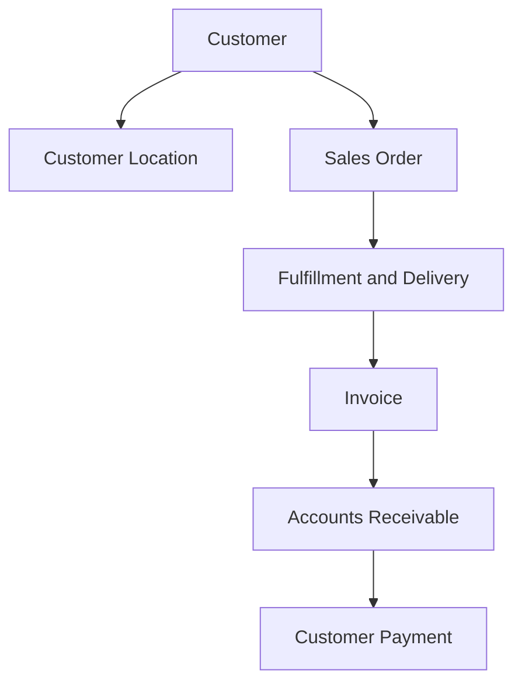
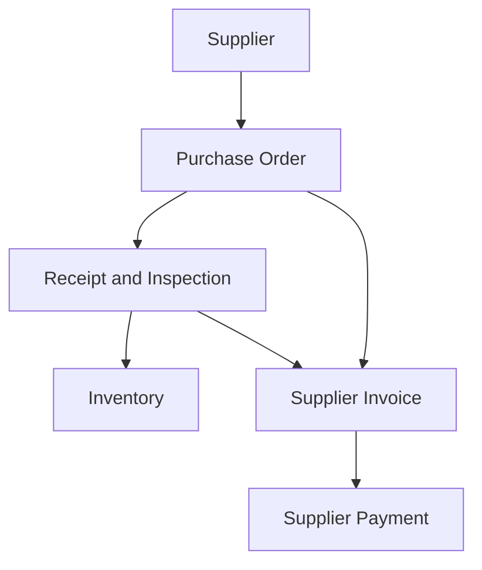
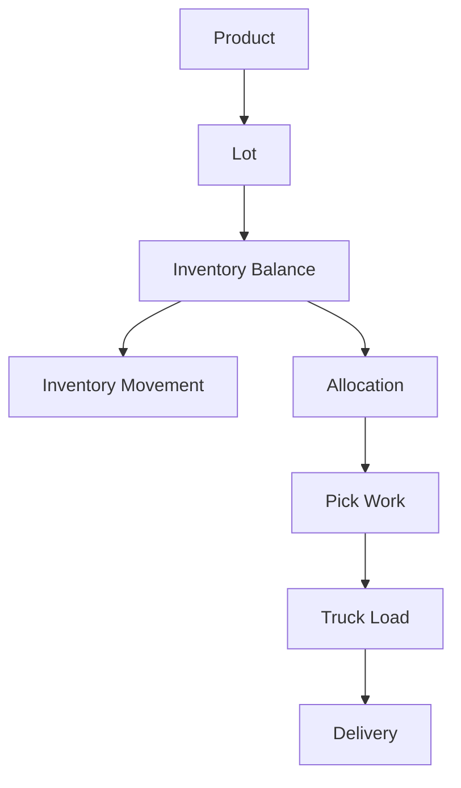

# Information Model and Record Ownership Specification

**Document date:** September 4, 2026  
**Document status:** Authoritative logical-information specification  
**Governing documents:**

- `Business_Model_and_Operating_Policies.md`
- `Business_to_IT_Capability_Specification.md`

---

## 1. Purpose

This document defines the logical business records and establishes who owns, creates, approves, changes, and consumes them.

It identifies:

- Permanent business keys
- Logical record boundaries
- Required business information
- Relationships among records
- Authoritative ownership
- Lifecycle states
- History and correction rules
- Retention classes
- Operational-to-accounting linkages

This is a logical business model. It does not define C++ classes, physical file layouts, byte formats, index structures, or user-interface designs.

---

## 2. Information-Model Principles

### 2.1 One business fact, one authority

Each important business fact has one authoritative record and business owner. Other records may reference or snapshot that fact but must not become competing sources.

### 2.2 Permanent identity

Customers, customer locations, employees, products, suppliers, trucks, accounts, fixed assets, and controlled transactions receive permanent keys. A key is never reassigned to another business object.

### 2.3 Business identity is separate from description

Names, addresses, descriptions, and statuses may change. The permanent key does not.

### 2.4 Effective dating

Prices, costs, credit limits, assignments, compensation, terms, policies, and other time-sensitive facts retain effective dates and history.

### 2.5 Completed transactions are historical evidence

Completed transactions are corrected through linked adjustments, reversals, credits, debits, or replacement transactions. They are not silently rewritten.

### 2.6 Current state and event history are both required

The simulation must be able to answer both:

- What is true now?
- What happened to produce the current state?

### 2.7 Operational time has several meanings

Records distinguish:

- Actual calendar timestamp
- Business operating date
- Fulfillment cycle
- Warehouse shift
- Accounting date and period

### 2.8 Operational transactions drive accounting

Accounting entries reference their originating business transactions. Accounting does not independently recreate sales, receipts, deliveries, payroll, or inventory movements.

---

## 3. Logical Record Classes

| Record class | Purpose | Change model |
|---|---|---|
| Master | Identifies a durable business entity | Controlled updates; inactivate rather than delete |
| Relationship | Connects two durable entities for a defined purpose or period | Effective-dated |
| Policy/configuration | Defines approved operating behavior | Versioned and effective-dated |
| Transaction | Records a business commitment or event | Status lifecycle; completed history preserved |
| Event/history | Records a state change or fact that occurred | Append-only |
| Balance/state | Represents current quantity or amount derived from transactions | Updated only by controlled transactions |
| Work item | Directs or tracks activity to be completed | Created, assigned, completed, cancelled, or escalated |
| Exception/hold | Blocks or flags activity requiring action | Opened, assigned, resolved, released, or closed |
| Financial posting | Records balanced accounting effect | Posted, reversed, or adjusted; never silently altered |
| Snapshot/report | Preserves an as-of view or formal output | Immutable after formal publication |

---

## 4. Key and Numbering Policy

### 4.1 Natural business primary keys

Logical records use meaningful, governed business numbers or codes as their primary keys. Customer Number, Supplier Number, Product Number, Employee Number, document numbers, and similar keys are permanent, unique within their defined business scope, and never reassigned. Surrogate identifiers are not introduced beside them.

Relationship, line, and history records use composite natural keys such as `(Sales Order Number, Line Number)` or `(Employee Number, Effective From)`. Descriptions, names, statuses, amounts, and other mutable attributes are never part of a primary key.

### 4.2 Business-number formats

Business primary keys may use prefixes:

| Record | Presentation example |
|---|---|
| Customer | `C00001234` |
| Customer location | `CL00000482` |
| Employee | `E00000421` |
| Product | `P00008761` |
| Supplier | `S00000117` |
| Sales order | `SO00015287` |
| Purchase order | `PO00004193` |
| Receipt | `RCV00003124` |
| Invoice | `INV00087431` |
| Credit memo | `CM00000641` |
| Customer payment | `CR00002197` |
| Supplier payment | `SP00001360` |
| Truck | `T00000006` |
| Route | `RT00000825` |
| Delivery | `DEL00015620` |
| Return authorization | `RA00000281` |
| Customer-service case | `CS00000853` |
| Journal entry | `JE00029874` |
| Fixed asset | `FA00000126` |
| Payroll run | `PR00000073` |

Prefixes are presentation conventions, not part of the logical identity.

### 4.3 Number-control record

A Number Control record owns the next available number for each controlled sequence. Number allocation is recorded. Gaps are permitted when a reserved transaction is cancelled, but duplicate or reused numbers are prohibited.

### 4.4 Composite uniqueness

Some relationships also require business uniqueness, including:

- One customer location number per customer location
- One supplier invoice number per supplier
- One active product/supplier relationship per product, supplier, and purchasing unit
- One inventory balance per product, location, lot, unit, and status combination
- One invoice line number within an invoice
- One journal line number within a journal entry

---

## 5. Enterprise Ownership Rules

### 5.1 Ownership meanings

| Responsibility | Meaning |
|---|---|
| Business owner | Defines policy and is accountable for correctness |
| Record custodian | Creates and maintains the record in normal operations |
| Approval owner | Authorizes controlled changes or exceptions |
| Consumer | Uses the information but does not own it |
| Financial control owner | Ensures financial classification, authorization, and reconciliation |

### 5.2 Domain ownership

| Information domain | Business owner | Financial/control owner |
|---|---|---|
| Company policy and operating calendar | General Management | Finance for fiscal controls |
| Customers and commercial relationships | Sales | Finance for tax and credit |
| Products and suppliers | Operations and Purchasing | Finance for costing and payment controls |
| Physical inventory and warehouse activity | Operations | Accounting for valuation and reconciliation |
| Transportation and delivery | Operations | Finance for asset and cost records |
| Customer billing and receivables | Finance | Finance |
| Supplier invoices and payables | Finance | Finance |
| Employees and payroll | Finance and Administration | Finance |
| Fixed assets, debt, equity, and cash | Finance | Finance |
| Posted accounting and financial periods | Accounting | Finance |
| Management reporting | General Management | Each source-domain owner |

---

## 6. High-Level Information Relationships

### 6.1 Customer-to-cash



### 6.2 Replenish-to-pay



### 6.3 Inventory and fulfillment



These diagrams show logical dependency, not physical storage or exact implementation cardinality.

### 6.4 Principal cardinalities

| Parent | Relationship | Child |
|---|---|---|
| Company | One-to-many; opening baseline has one | Facility |
| Facility | One-to-many | Warehouse Zone and Warehouse Location |
| Customer | One-to-many | Customer Location, Contact, Contract, Sales Order, Invoice |
| Customer Location | One-to-many | Delivery Schedule, Route Stop, Delivery |
| Employee | One-to-many over time | Assignment, Schedule, Time Entry, Qualification, Payroll Result |
| Product | One-to-many | Product Pack, Supplier Product, Price, Inventory Lot, Order Line |
| Supplier | One-to-many | Supplier Product, Purchase Order, Receipt, Supplier Invoice |
| Sales Order | One-to-many | Sales Order Line, Hold, Change, Allocation, Delivery fulfillment |
| Sales Order Line | One-to-many when needed | Allocation, Pick Result, Backorder, Delivery Line |
| Purchase Order | One-to-many | Purchase Order Line, Acknowledgement, Receipt |
| Purchase Order Line | One-to-many | Receipt Line and Supplier Invoice Line match evidence |
| Inventory Lot | One-to-many | Inventory Balance, Movement, Pick-Slot Placement |
| Daily Route | One-to-many | Route Stop, Delivery, Route Cost detail |
| Delivery | One-to-many | Delivery Line and Proof-of-Delivery evidence |
| Customer Invoice | One-to-many | Customer Invoice Line and AR Open Item consequences |
| Customer Receipt | One-to-many | Receipt Application |
| Supplier Invoice | One-to-many | Supplier Invoice Line, Match Result, AP Open Item |
| Supplier Payment | One-to-many | Paid AP Open Items through remittance/application detail |
| Payroll Run | One-to-many | Payroll Employee Result and Payroll Payment |
| Journal Entry | One-to-many | Journal Line |
| Fixed Asset | One-to-many over time | Depreciation Entry, Maintenance Event, Transfer, Verification |

---

## 7. Company, Facility, Calendar, and Governance Records

| Logical record | Permanent key | Business owner | Record custodian | Purpose |
|---|---|---|---|---|
| Company | Company Number | General Management | Administration | Legal and operating identity of the business |
| Facility | Facility Number | General Management | Operations | Office, warehouse, and distribution location |
| Warehouse Zone | Zone Number | Operations | Warehouse Management | Dry, refrigerated, frozen, produce, receiving, staging, quarantine, and other areas |
| Warehouse Location | Location Number | Operations | Warehouse Management | Reserve, pick, dock, staging, hold, and disposition positions |
| Operating Calendar | Calendar Number | General Management | Administration | Open days, closed days, holidays, and exceptions |
| Shift Definition | Shift Number | Operations | Warehouse Management | First, second, and third shift definitions |
| Fulfillment Cycle | Fulfillment Cycle Number | Operations | Computer Operations | Business cycle connecting order day, overnight work, and delivery day |
| Accounting Period | Period Number | Finance | Accounting | Open, closing, and closed fiscal periods |
| Approval Authority | Authority Number | General Management | Administration | Role, transaction, threshold, and required approval |
| Policy Version | Policy Version Number | Responsible owner | Administration | Effective-dated business rule and approval |
| Annual Budget | Budget Number | Owners | Finance | Approved operating and financial plan |
| Capital Plan | Capital Plan Number | Owners | Finance | Approved capital investment plan |
| Simulation Session | Session Number | General Management | Computer Operations | Technical execution interval, business clock, configuration, random seed, status, and diagnostic result; it does not own business records |
| Number Control | Sequence Number | Finance/Administration | Computer Operations | Next permanent transaction or master number |

### 7.1 Facility relationships

- The business owns one opening Facility at \<business address>.
- A Facility contains Warehouse Zones.
- A Warehouse Zone contains Warehouse Locations.
- A Warehouse Location has one operating purpose and storage class at a time.
- Location-purpose changes are effective-dated and preserve history.

### 7.2 Fulfillment-cycle relationship

A Fulfillment Cycle connects:

- Originating order date
- Second-shift work date/time
- Third-shift work date/time
- Planned truck departure
- Expected customer delivery date

This preserves the business relationship when warehouse work crosses midnight.

---

## 8. Ownership and Management Records

| Logical record | Key | Owner | Purpose and relationships |
|---|---|---|---|
| Owner | Owner Number | Owners | Identifies an equity owner and links to Person and Employee when active in management |
| Ownership Interest | Ownership Interest Number | Owners | Effective-dated ownership percentage; total active ownership must equal 100% |
| Management Assignment | Assignment Number | General Management | Links an Owner or Employee to a management responsibility and authority period |
| Owner Approval | Approval Number | Owners | Records vote, decision, date, matter, and supporting transaction |
| Owner Capital Transaction | Capital Transaction Number | Finance | Contribution, distribution, or other equity event linked to accounting |

### 8.1 Opening ownership

The selected opening baseline supplies a configurable owner roster. Each Owner has a stable natural Owner Number linked to the applicable Person/Party. Effective Ownership Interests identify the percentage and effective period; active interests total exactly 100 percent at baseline time.

Management Assignments separately associate qualified owners or Employees with General Management, Sales, Operations and Purchasing, Finance and Administration, and other approved responsibilities. Ownership percentage does not itself grant operational authority.

Major reserved decisions link to the affirmative Owner Approval records required by the effective governance policy. Approval thresholds are configuration validated against the active owner roster and do not assume a fixed owner count.

---

## 9. Customer and Sales Records

| Logical record | Key | Owner/custodian | Required relationships |
|---|---|---|---|
| Customer | Customer Number | Sales | Segment, salesperson, credit profile, locations, orders, invoices |
| Customer Location | Customer Location Number | Sales / Customer Service | One Customer; route territory; delivery schedule |
| Customer Contact | Contact Number | Sales / Customer Service | Customer or Location; authorized functions |
| Customer Sales Assignment | Assignment Number | Sales | Customer, Sales Representative, effective period |
| Customer Delivery Schedule | Schedule Number | Customer Service | Location, weekday, receiving window, route pattern |
| Customer Product Preference | Preference Number | Sales / Customer Service | Customer or Location, Product/category, preference or restriction |
| Customer Substitution Rule | Substitution Rule Number | Sales / Customer Service | Customer, original Product, allowed substitute behavior |
| Customer Tax Profile | Tax Profile Number | Finance | Customer, jurisdiction, exemption status, evidence, dates |
| Customer Contract | Contract Number | Sales | Customer, locations, effective period, commercial obligations |
| Customer Onboarding Review | Review Number | Sales and Finance | Required setup checks and approvals |
| Sales Activity | Activity Number | Sales | Customer, salesperson, contact, purpose, outcome, follow-up |

### 9.1 Customer core information

Customer holds durable identity and classification:

- Legal and trade name
- Customer segment
- Billing address
- Status
- Assigned salesperson
- Default terms reference
- Credit Profile reference
- Tax Profile reference
- Opening and closing dates

Delivery details belong to Customer Location rather than Customer so one legal customer may have multiple receiving sites.

### 9.2 Customer lifecycle

```text
PROSPECTIVE -> ONBOARDING -> ACTIVE -> SUSPENDED -> ACTIVE
                                  \-> INACTIVE -> CLOSED
```

- `PROSPECTIVE`: Sales relationship exists; transactions are not yet permitted.
- `ONBOARDING`: Required legal, tax, location, and credit information is being approved.
- `ACTIVE`: Authorized for business subject to credit and order controls.
- `SUSPENDED`: New transactions blocked temporarily.
- `INACTIVE`: No routine business expected; history retained.
- `CLOSED`: Relationship ended; history retained permanently according to retention policy.

### 9.3 Customer record rules

- A Customer cannot become active without at least one approved Customer Location.
- Credit approval is independent of Sales approval.
- Location receiving windows and restrictions override general customer defaults.
- Customer closure does not remove invoices, payments, deliveries, or history.

---

## 10. Credit and Collections Records

| Logical record | Key | Owner/custodian | Purpose |
|---|---|---|---|
| Credit Profile | Credit Profile Number | Finance/Credit | Terms, limit, risk, hold, review date |
| Credit Review | Credit Review Number | Finance/Credit | Evidence, analysis, decision, approver, next review |
| Credit Hold | Credit Hold Number | Finance/Credit | Hold reason, scope, start, release, authority |
| Credit Exception | Credit Exception Number | Finance/Credit | Temporary order or limit authorization |
| Collection Case | Collection Case Number | Finance/Collections | Overdue exposure, assigned collector, status |
| Collection Activity | Collection Activity Number | Finance/Collections | Contact, promise, dispute, outcome, next action |
| Promise to Pay | Promise Number | Finance/Collections | Customer, amount, promised date, fulfillment result |
| Customer Dispute | Dispute Number | Finance/Customer Service | Invoice or deduction under review |
| Expected Credit Loss Assessment | Assessment Number | Finance/Accounting | Period estimate and supporting customer risk |

### 10.1 Credit-profile relationships

- One active Credit Profile controls each Customer.
- A Credit Hold may apply to the entire Customer, one Location, or one order.
- A Credit Exception authorizes a specific deviation without rewriting the normal limit or terms.
- Order exposure includes AR, released orders, pending deliveries, and the proposed order.

### 10.2 Credit-hold lifecycle

```text
PROPOSED -> ACTIVE -> UNDER_REVIEW -> RELEASED
                  \-> EXPIRED
```

An active Finance hold cannot be removed by Sales.

---

## 11. Product and Assortment Records

| Logical record | Key | Owner/custodian | Required relationships |
|---|---|---|---|
| Product | Product Number | Operations/Purchasing | Category, units, storage, suppliers, prices, inventory |
| Product Category | Category Number | Operations/Purchasing | Parent category and reporting hierarchy |
| Unit of Measure | Unit Number | Operations/Purchasing | Case, pack, each, pallet, or other fixed unit |
| Product Pack | Product Pack Number | Operations/Purchasing | Product, unit, contained quantity, full/split status |
| Storage Requirement | Storage Requirement Number | Operations/Quality | Product, zone class, temperature, segregation |
| Shelf-Life Rule | Shelf-Life Rule Number | Operations/Quality | Product, date type, minimum receipt and shipment life |
| Product Substitute | Substitute Number | Sales and Operations | Original Product, substitute Product, approval constraints |
| Supplier Product | Supplier Product Number | Purchasing | Supplier, Product, supplier item, cost, case pack, lead time |
| Product Status History | Status Event Number | Operations/Purchasing | Active, seasonal, suspended, discontinued, recalled |

### 11.1 Product core information

- Permanent product number
- Description and brand
- Food/nonfood classification
- Product category
- Stocking unit
- Standard selling unit
- Split-pack permission
- Case and pallet configuration
- Weight and cube for capacity planning
- Storage and temperature requirement
- Lot/date-control requirement
- Shelf-life rule
- Reorder and safety-stock policy reference
- Status

### 11.2 Product lifecycle

```text
PROPOSED -> APPROVED -> ACTIVE <-> SUSPENDED
                         |  \-> RECALLED
                         \-> DISCONTINUING -> DISCONTINUED
```

Suspended, recalled, and discontinued Products remain available to historical transactions but are blocked from new activity according to policy.

### 11.3 Unit and pricing rules

- The normal selling unit is a full case.
- Split packs use an approved Product Pack and incur the standard premium unless an effective-dated exception exists.
- No Product Pack represents a warehouse-determined catch weight.
- Unit conversions are explicit and never inferred from description text.

---

## 12. Supplier and Purchasing-Relationship Records

| Logical record | Key | Owner/custodian | Purpose |
|---|---|---|---|
| Supplier | Supplier Number | Purchasing | Durable supplier identity and operational status |
| Supplier Location | Supplier Location Number | Purchasing | Ordering, shipping, return, and remittance locations |
| Supplier Contact | Contact Number | Purchasing/AP | Operational, quality, claims, and payment contacts |
| Supplier Approval | Supplier Approval Number | Purchasing/Quality | Approval scope, evidence, dates, status |
| Supplier Terms | Supplier Terms Number | Finance/AP | Payment terms, discount, freight and remittance rules |
| Supplier Performance Period | Performance Number | Purchasing | Fill, timing, quality, rejection, claim, and responsiveness measures |
| Supplier Claim | Supplier Claim Number | Purchasing | Damage, shortage, quality, return, or financial recovery |
| Supplier Cost | Supplier Cost Number | Purchasing | Effective-dated Product, unit, cost, allowance, freight basis |

### 12.1 Supplier lifecycle

```text
PROSPECTIVE -> CONDITIONAL -> APPROVED <-> SUSPENDED
                                  \-> INACTIVE
```

- Purchase Orders normally require an approved Supplier and valid Supplier Product relationship.
- Remittance changes require independent Finance verification and history.
- Inactivation never removes purchase, receipt, invoice, payment, or claim history.

---

## 13. Pricing and Contract Records

| Logical record | Key | Owner/custodian | Purpose |
|---|---|---|---|
| Price List | Price List Number | Sales | Named commercial schedule and effective period |
| Product Price | Product Price Number | Sales | Product, selling unit, amount, effective dates |
| Customer Price | Customer Price Number | Sales | Customer/location-specific Product price |
| Contract Price | Contract Price Number | Sales | Contract, Product/category, price, volume and dates |
| Split-Pack Premium | Premium Number | Sales/Finance | Standard 15% premium and approved exceptions |
| Delivery Charge Rule | Charge Rule Number | Sales/Finance | Small-order and expedited-delivery charge policy |
| Margin Rule | Margin Rule Number | Finance | Margin floor, calculation basis, exception authority |
| Price Override | Price Override Number | Sales/Finance | Specific approved deviation and reason |

### 13.1 Price precedence

When more than one price may apply, the normal precedence is:

1. Approved contract price
2. Approved customer-specific price
3. Approved promotional price
4. Standard price-list price
5. Authorized manual price override

A split-pack premium is applied after the base price is selected unless the effective agreement explicitly includes split pricing.

### 13.2 Price snapshot rule

Every Sales Order Line retains:

- Applied unit price
- Selling unit
- Price source
- Discounts or premium
- Expected cost and margin at order release
- Approval reference when required

Later price or cost changes do not rewrite the order-line snapshot.

---

## 14. Sales-Order Records

| Logical record | Key | Owner/custodian | Purpose |
|---|---|---|---|
| Sales Order | Sales Order Number | Customer Service | Customer commitment and fulfillment control |
| Sales Order Line | Sales Order Number + Line Number | Customer Service | Requested Product, unit, quantity, price, status |
| Standing Order Template | Template Number | Sales/Customer Service | Recurring customer order pattern |
| Order Hold | Order Hold Number | Owning control function | Credit, price, customer, product, or operational block |
| Order Change | Order Change Number | Customer Service | Before/after values, requester, reason, time |
| Inventory Allocation | Allocation Number | Operations | Order Line to Product quantity and planned source |
| Substitution Decision | Substitution Decision Number | Customer Service/Operations | Original, substitute, customer consent, outcome |
| Backorder | Backorder Number | Customer Service | Unfilled Order Line quantity and planned resolution |
| Order Exception | Order Exception Number | Responsible function | Shortage, cutoff, capacity, or validation problem |

### 14.1 Sales Order core information

- Order number
- Customer and delivery location
- Order channel and originating contact
- Salesperson
- Actual order timestamp
- Business order date
- Requested and scheduled delivery date
- Fulfillment Cycle
- Order type
- Status
- Credit, pricing, allocation, and route readiness
- Totals and order-minimum result

### 14.2 Order lifecycle

```text
ENTERED -> VALIDATING -> HELD -> VALIDATING
                    \-> READY -> RELEASED -> PICKING -> LOADED
                                                  \-> PARTIAL
LOADED -> DISPATCHED -> DELIVERED -> COMPLETED
                    \-> DELIVERY_EXCEPTION
ENTERED/HELD/READY -> CANCELLED
```

### 14.3 Order-line lifecycle

```text
REQUESTED -> PRICED -> ALLOCATED -> PICKED -> LOADED -> DELIVERED
                   \-> SHORT -> SUBSTITUTED/BACKORDERED/CANCELLED
```

### 14.4 Order record rules

- An Order cannot be released until customer, credit, price, inventory, and route requirements are satisfied or properly overridden.
- A released Order is not overwritten by a late change. An Order Change records the approved change.
- Partial fulfillment is represented at line level.
- A Backorder references the originating Order Line.
- One Order may result in more than one Delivery only when an approved partial or rescheduled fulfillment occurs.

---

## 15. Inventory Records

| Logical record | Key | Owner/custodian | Purpose |
|---|---|---|---|
| Inventory Lot | Inventory Lot Number | Operations/Receiving | Supplier lot, date, Product, receipt origin |
| Pallet | Pallet Number | Operations/Warehouse | Physical pallet identity and current location |
| Inventory Balance | Balance identity | Operations | Current Product quantity by location, lot, unit, status |
| Inventory Movement | Movement Number | Operations/Warehouse | Quantity moved between locations/statuses |
| Inventory Status Change | Status Change Number | Operations/Quality | Hold, release, damage, expiry, quarantine, disposition |
| Pick-Slot Placement | Placement Number | Operations/Warehouse | Lot/pallet placed in pick slot with date/time |
| Replenishment Work | Work Number | Warehouse | Planned or emergency reserve-to-pick movement |
| Inventory Count | Count Number | Warehouse | Scope, blind expected quantity, observed quantity |
| Inventory Recount | Recount Number | Warehouse | Independent verification of variance |
| Inventory Adjustment | Adjustment Number | Operations/Accounting | Approved quantity/value correction and reason |
| Inventory Disposition | Disposition Number | Operations/Quality | Return, discount sale, donation, destruction, other removal |
| Inventory Valuation Layer | Valuation Layer Number | Accounting | FIFO cost quantity associated with acquisition |

### 15.1 Inventory Balance identity

Inventory Balance is uniquely identified by the logical combination of:

- Facility
- Warehouse Location
- Product
- Unit of measure
- Inventory Lot, when applicable
- Inventory status

It is a current-state record produced by Inventory Movements, receipts, picks, returns, adjustments, and dispositions.

### 15.2 Inventory status values

- `AVAILABLE`
- `ALLOCATED`
- `IN_RESERVE`
- `IN_PICK_SLOT`
- `PICKED`
- `STAGED`
- `LOADED`
- `QUALITY_HOLD`
- `QUARANTINED`
- `DAMAGED`
- `RETURNED`
- `EXPIRED`
- `PENDING_DISPOSITION`

Location and availability are separate concepts. For example, a lot may physically remain in a reserve location while its business status is `QUALITY_HOLD`.

### 15.3 Lot and FEFO rules

- Inventory Lot stores supplier lot number and expiration/best-by date when supplied.
- Pick-Slot Placement records when a Lot or Pallet enters a picking location.
- Multiple Lots may exist in one picking slot.
- The earliest-expiring eligible Lot is depleted first.
- Equal expiration dates use the oldest Pick-Slot Placement time.
- Below-minimum shelf-life, expired, recalled, held, and quarantined balances are ineligible for normal allocation.

### 15.4 Deliberate outbound traceability boundary

The business does not store an exact Inventory Lot reference on each customer shipment line. Customer recall exposure is estimated from:

- Supplier receipt and Inventory Lot
- Location and Pick-Slot Placement history
- Inventory Movements
- Pick and shipment times
- Remaining quantities
- Product/date customer shipment history

The resulting Recall Exposure record must identify that it is an estimate.

### 15.5 Inventory correction rules

- A count does not directly overwrite Inventory Balance.
- A significant variance requires Recount and approval.
- The approved Inventory Adjustment creates both quantity and accounting consequences.
- Original count evidence is retained.

---

## 16. Purchasing Records

| Logical record | Key | Owner/custodian | Purpose |
|---|---|---|---|
| Purchase Recommendation | Recommendation Number | Purchasing | System- or planner-proposed replenishment |
| Purchase Recommendation Decision | Decision Number | Buyer | Accept, modify, defer, or reject with reason |
| Purchase Order | Purchase Order Number | Purchasing | Approved supplier commitment |
| Purchase Order Line | PO Number + Line Number | Purchasing | Product, unit, quantity, cost, expected date |
| Supplier Acknowledgement | Acknowledgement Number | Purchasing | Supplier confirmation and differences |
| Purchase Order Change | PO Change Number | Purchasing | Approved revision with history |
| Purchase Commitment | Commitment Number | Purchasing/Finance | Open quantity and expected cash requirement |

### 16.1 Purchase Order lifecycle

```text
DRAFT -> PENDING_APPROVAL -> APPROVED -> SENT -> ACKNOWLEDGED
                                   \-> CANCELLED
ACKNOWLEDGED -> PARTIALLY_RECEIVED -> RECEIVED -> CLOSED
             \-> SUPPLIER_DELAY/EXCEPTION
```

### 16.2 Purchase rules

- A Purchase Order references one approved Supplier and one ship-to Facility.
- Each line references one Supplier Product relationship and agreed purchasing unit.
- Actual receipts do not rewrite ordered quantity.
- Supplier changes appear in Supplier Acknowledgement and approved PO Change records.
- Purchase Commitment decreases through accepted receipts, approved cancellation, or closure.

---

## 17. Receiving and Quality Records

| Logical record | Key | Owner/custodian | Purpose |
|---|---|---|---|
| Receiving Appointment | Appointment Number | Receiving | Supplier, date/time, dock, capacity reservation |
| Inbound Shipment | Inbound Shipment Number | Receiving | Supplier truck/load and related Purchase Orders |
| Receipt | Receipt Number | Receiving | Completed receiving transaction |
| Receipt Line | Receipt Number + Line Number | Receiving | Ordered, delivered, accepted, rejected, held quantities |
| Receipt Inspection | Inspection Number | Receiving/Quality | Condition, temperature, seal, lot, date, shelf life |
| Receiving Discrepancy | Discrepancy Number | Receiving | Short, over, damage, substitution, price-independent issue |
| Quality Hold | Quality Hold Number | Quality/Operations | Scope, reason, authority, release/disposition |
| Temperature Observation | Observation Number | Receiving/Quality | Location/product/trailer, value, time, limits, result |
| Putaway Work | Work Number | Warehouse | Accepted or held inventory to destination |

### 17.1 Receipt lifecycle

```text
EXPECTED -> ARRIVED -> INSPECTING -> PARTIALLY_ACCEPTED/ACCEPTED
                                \-> HELD
                                \-> REJECTED
ACCEPTED/PARTIALLY_ACCEPTED -> PUTAWAY_COMPLETE -> CLOSED
```

### 17.2 Receipt-line quantities

A Receipt Line separately retains:

- Purchase quantity expected
- Supplier quantity presented
- Quantity accepted
- Quantity rejected
- Quantity held or quarantined
- Quantity short or over
- Unit of measure
- Inventory Lot and inspection references

Only accepted quantity becomes available inventory. Held quantity becomes inventory in a nonavailable status.

### 17.3 Three-way-match relationship

Receipt Line provides the accepted-quantity evidence used to match Supplier Invoice Line to Purchase Order Line. Receiving cannot change ordered price to force agreement.

---

## 18. Food-Safety, Sanitation, and Recall Records

| Logical record | Key | Owner/custodian | Purpose |
|---|---|---|---|
| Food-Safety Responsibility | Responsibility Number | Operations | Assigned leader, backup, scope, effective dates |
| Sanitation Task | Sanitation Task Number | Operations | Required area/activity and schedule |
| Sanitation Completion | Completion Number | Operations | Performer, result, exception, verification |
| Pest-Control Activity | Activity Number | Operations | Inspection/service, finding, corrective action |
| Food-Safety Training | Training Number | HR/Operations | Employee, course, completion, expiration |
| Food-Safety Incident | Incident Number | Operations | Suspected or confirmed unsafe condition |
| Corrective Action | Corrective Action Number | Responsible manager | Required action, owner, due date, verification |
| Product Withdrawal/Recall | Recall Number | Operations | Product scope, supplier notice, dates, status |
| Recall Exposure | Exposure Number | Operations | Estimated affected inventory and customer shipment window |
| Recall Communication | Communication Number | Operations | Party, time, method, content, acknowledgement |
| Recall Effectiveness Review | Review Number | Operations/Owners | Completion evidence and management signoff |

### 18.1 Recall lifecycle

```text
REPORTED -> ASSESSING -> PRODUCT_HELD -> ACTIVE_RESPONSE
ACTIVE_RESPONSE -> MONITORING -> EFFECTIVENESS_REVIEW -> CLOSED
```

### 18.2 Recall rules

- A Recall may place one or more Products, Lots, Locations, Suppliers, or receipt periods on hold.
- A Recall Exposure may link to customer shipment lines by Product and time window but not by exact outbound Lot.
- The estimate method and uncertainty are recorded.
- Closure requires disposition, communication, reconciliation, corrective action, and management review.

---

## 19. Warehouse Work Records

| Logical record | Key | Owner/custodian | Purpose |
|---|---|---|---|
| Warehouse Work Batch | Work Batch Number | Warehouse | Work grouped by Fulfillment Cycle, shift, route, or function |
| Warehouse Work Task | Work Task Number | Warehouse | Base task identity, assignment, timing, and status |
| Pick Work | Pick Work Number | Warehouse | Order Line quantity to pick from approved location |
| Pick Result | Pick Result Number | Warehouse | Picked, short, damaged, skipped, or substituted result |
| Stage Assignment | Stage Assignment Number | Warehouse | Order/route product to staging location |
| Load Plan | Load Plan Number | Warehouse/Dispatch | Truck, route, stop order, temperature compartment |
| Load Line | Load Plan Number + Line Number | Warehouse | Product/order quantity planned and loaded |
| Load Reconciliation | Reconciliation Number | Warehouse | Planned versus loaded result and approval |
| Warehouse Exception | Exception Number | Warehouse | Replenishment, pick, stage, load, or capacity issue |

### 19.1 Work-task lifecycle

```text
PLANNED -> RELEASED -> ASSIGNED -> IN_PROGRESS -> COMPLETED
                         \-> HELD/EXCEPTION -> RESUMED
PLANNED/RELEASED -> CANCELLED
```

### 19.2 Work ownership rules

- Warehouse Work Task records the responsible employee and shift.
- Completion records actual timestamp, Product, unit, quantity, source, destination, and result.
- Split-pack work is explicitly identified.
- Pick Result updates the Order Line and inventory through controlled handoffs.
- Undocumented product cannot appear on Load Line.

---

## 20. Transportation and Delivery Records

| Logical record | Key | Owner/custodian | Purpose |
|---|---|---|---|
| Truck | Truck Number | Transportation | Durable vehicle identity and operating status |
| Truck Compartment | Compartment Number | Transportation | Ambient, refrigerated, frozen capacity |
| Vehicle Inspection | Inspection Number | Driver/Transportation | Pretrip, posttrip, safety, and temperature readiness |
| Maintenance Plan | Maintenance Plan Number | Transportation | Scheduled preventive work |
| Maintenance Event | Maintenance Event Number | Transportation | Actual repair/service, cost, downtime |
| Route Pattern | Route Pattern Number | Transportation | Stable service corridor and normal customer sequence |
| Daily Route | Route Number | Dispatch | Date-specific truck, driver, capacity, and status |
| Route Stop | Route Number + Stop Number | Dispatch | Customer Location, window, sequence, delivery references |
| Dispatch Record | Dispatch Number | Dispatch | Load approval, actual departure, dispatcher |
| Delivery | Delivery Number | Driver/Transportation | Customer stop fulfillment result |
| Delivery Line | Delivery Number + Line Number | Driver/Transportation | Accepted, refused, damaged, or short quantity |
| Proof of Delivery | POD Number | Driver/Transportation | Receiver identity, time, acknowledgement |
| Delivery Exception | Exception Number | Driver/Customer Service | Late, refused, unavailable, wrong, damaged, temperature issue |
| Driver Return | Driver Return Number | Driver/Warehouse | Product returned to The business custody after route |
| Route Cost | Route Cost Number | Transportation/Finance | Mileage, fuel, labor, toll, maintenance allocation |

### 20.1 Truck lifecycle

```text
ORDERED -> RECEIVED -> AVAILABLE <-> ASSIGNED
                       |          \-> IN_SERVICE
                       \-> MAINTENANCE -> AVAILABLE
                       \-> OUT_OF_SERVICE -> RETIRED
```

### 20.2 Daily Route lifecycle

```text
PLANNED -> ASSIGNED -> LOADING -> READY -> DISPATCHED
DISPATCHED -> IN_PROGRESS -> COMPLETED
                         \-> EXCEPTION -> COMPLETED/CANCELLED
```

### 20.3 Delivery rules

- One Daily Route uses one Truck and normally one primary Driver.
- A Route Stop references one Customer Location.
- A Delivery references one Route Stop and one or more Sales Orders or fulfillment portions.
- Proof of Delivery confirms customer acceptance.
- Driver-recorded exceptions do not themselves authorize price changes or credits.
- Driver Return transfers custody to the controlled returns process.

---

## 21. Billing and Accounts-Receivable Records

| Logical record | Key | Owner/custodian | Purpose |
|---|---|---|---|
| Customer Invoice | Invoice Number | Finance/Billing | Customer billing document and AR source |
| Customer Invoice Line | Invoice Number + Line Number | Finance/Billing | Delivered Product, quantity, price, revenue classification |
| Credit Memo | Credit Memo Number | Finance | Approved reduction of customer balance/revenue |
| Debit Memo | Debit Memo Number | Finance | Approved additional customer charge |
| AR Open Item | AR Item Number | Finance/AR | Open invoice, credit, debit, payment, or adjustment balance |
| Customer Receipt | Customer Receipt Number | Finance/AR | Money received from customer |
| Receipt Application | Application Number | Finance/AR | Receipt or credit applied to AR Open Item |
| Customer Statement | Statement Number | Finance/AR | Published as-of listing of customer activity and balance |
| AR Adjustment | AR Adjustment Number | Finance | Approved correction, write-off, refund, or reclassification |

### 21.1 Invoice lifecycle

```text
PREPARED -> PRINTED -> PENDING_DELIVERY -> FINALIZED -> POSTED -> SETTLED
                                       \-> DELIVERY_EXCEPTION -> ADJUSTED/VOIDED
```

### 21.2 Invoice timing rule

- Customer Invoice and number are created before truck departure.
- The printed invoice accompanies the delivery.
- Before accepted delivery, the invoice remains pending and does not create final revenue or AR.
- Delivery acceptance finalizes delivered quantities and triggers posting.
- Postdeparture differences use linked adjustment documents; the original printed history remains visible.

### 21.3 AR relationships

- Posted Customer Invoice creates an AR Open Item.
- Credit Memo and Customer Receipt reduce one or more AR Open Items through Receipt Application or credit application.
- Customer Receipt may remain temporarily unapplied but must remain part of customer and cash reconciliation.
- AR subsidiary totals reconcile to the GL control account.

---

## 22. Customer Service, Return, and Credit Records

| Logical record | Key | Owner/custodian | Purpose |
|---|---|---|---|
| Customer-Service Case | Case Number | Customer Service | Central record for complaint, request, or exception |
| Case Activity | Case Activity Number | Customer Service | Communication, ownership, decision, and follow-up |
| Return Authorization | Return Authorization Number | Customer Service | Approved return scope and conditions |
| Return Receipt | Return Receipt Number | Warehouse | Physical return to The business custody |
| Return Inspection | Return Inspection Number | Operations/Quality | Condition, temperature, seal, and resale determination |
| Return Disposition | Return Disposition Number | Operations | Available, hold, supplier return, donation, disposal |
| Customer Credit Request | Credit Request Number | Customer Service | Requested financial resolution |
| Credit Approval | Credit Approval Number | Finance/Management | Authority, amount, reason, source transaction |
| Root-Cause Assignment | Root Cause Number | Responsible manager | Product, supplier, picker, driver, route, or process cause |

### 22.1 Case lifecycle

```text
OPEN -> ASSIGNED -> INVESTIGATING -> RESOLUTION_APPROVED
RESOLUTION_APPROVED -> FINANCIAL/OPERATIONAL_ACTION -> VERIFIED -> CLOSED
```

### 22.2 Return rules

- Returned inventory is unavailable until inspected.
- Temperature-controlled goods that left The business control are presumed unsuitable for resale unless integrity is established.
- A Customer Credit Request does not create a Credit Memo until authorized.
- Case closure requires all related inventory, financial, supplier, and customer actions to be completed.

---

## 23. Accounts-Payable Records

| Logical record | Key | Owner/custodian | Purpose |
|---|---|---|---|
| Supplier Invoice | Supplier Invoice Number | Finance/AP | Supplier claim for payment |
| Supplier Invoice Line | Supplier Invoice Number + Line Number | Finance/AP | Product, expense, freight, tax, or other charge |
| Match Result | Match Result Number | Finance/AP | PO, Receipt, Invoice comparison |
| Match Exception | Match Exception Number | Finance/AP | Quantity, price, freight, duplicate, or other difference |
| Supplier Dispute | Supplier Dispute Number | AP/Purchasing | Disputed amount, communication, resolution |
| AP Open Item | AP Item Number | Finance/AP | Payable invoice, credit, payment, or adjustment balance |
| Payment Proposal | Proposal Number | Finance/AP | Invoices selected for payment and discount analysis |
| Supplier Payment | Supplier Payment Number | Finance/AP | Approved disbursement |
| Supplier Remittance | Remittance Number | Finance/AP | Explanation of invoices, credits, and disputed amounts paid |
| Supplier Credit | Supplier Credit Number | Finance/AP | Supplier-issued reduction or recovery |

### 23.1 Supplier Invoice lifecycle

```text
RECEIVED -> DUPLICATE_CHECK -> MATCHING -> MATCHED -> APPROVED -> SCHEDULED -> PAID
                                      \-> EXCEPTION -> RESOLVED -> MATCHED
```

### 23.2 Match relationships

Each matched Product charge connects:

- Supplier Invoice Line
- Purchase Order Line
- One or more accepted Receipt Lines

Disputed and undisputed amounts remain separate. An unresolved dispute does not prevent timely payment of the undisputed amount.

### 23.3 Payment rules

- Payment Proposal considers due date, discount date, cash forecast, supplier relationship, and payment priority.
- Supplier Payment requires approval independent of ordinary invoice entry.
- Supplier Payment creates or updates AP Open Items and accounting entries exactly once.
- Supplier Remittance clearly communicates partial payment and disputed amounts.

---

## 24. Employee, Scheduling, and Payroll Records

| Logical record | Key | Owner/custodian | Purpose |
|---|---|---|---|
| Person | Person Number | HR | Restricted personal identity shared with employee/owner roles |
| Employee | Employee Number | HR | Durable employment identity and status |
| Department | Department Number | General Management | Organizational responsibility |
| Position | Position Number | HR | Role, classification, qualifications, compensation basis |
| Employee Assignment | Assignment Number | HR/Manager | Employee, Department, Position, manager, effective dates |
| Compensation Rate | Compensation Rate Number | HR/Finance | Hourly/salary amount and effective date |
| Work Schedule | Work Schedule Number | Manager | Planned employee date, shift, and hours |
| Attendance Event | Attendance Event Number | Manager/HR | Present, absent, late, leave, or other attendance result |
| Time Entry | Time Entry Number | Employee/Manager | Actual regular and overtime work |
| Leave Balance | Leave Balance Number | HR | Earned, used, adjusted, and available leave |
| Qualification | Qualification Number | HR/Operations | License, training, capability, expiration |
| Payroll Run | Payroll Run Number | Finance/Payroll | Controlled payroll period and status |
| Payroll Employee Result | Payroll Run + Employee Number | Finance/Payroll | Gross pay, deductions, taxes, net pay, liabilities |
| Payroll Payment | Payroll Payment Number | Finance | Employee payment and cash consequence |
| Payroll Liability | Payroll Liability Number | Finance | Tax, deduction, and benefit obligation |

### 24.1 Employee lifecycle

```text
CANDIDATE -> HIRED -> ACTIVE <-> LEAVE
                    |       \-> SUSPENDED
                    \-> TERMINATED -> ARCHIVED
```

### 24.2 Payroll lifecycle

```text
OPEN -> TIME_COLLECTION -> MANAGER_APPROVAL -> CALCULATED
CALCULATED -> REVIEWED -> APPROVED -> PAID -> POSTED -> CLOSED
```

### 24.3 HR and payroll rules

- Person data is restricted and separated logically from general operational Employee information.
- Compensation changes are effective-dated and approved.
- Employee availability feeds department/shift capacity.
- Terminated Employees cannot receive routine payroll; controlled final payments remain possible.
- Owner payroll and Owner Capital Transactions remain separate.

---

## 25. Financial Foundation Records

| Logical record | Key | Owner/custodian | Purpose |
|---|---|---|---|
| GL Account | Account Number | Finance/Accounting | Permanent chart-of-accounts identity |
| Account Hierarchy | Hierarchy Number | Accounting | Financial statement classification and rollup |
| Journal Entry | Journal Entry Number | Accounting | Balanced financial transaction header |
| Journal Line | Journal Entry Number + Line Number | Accounting | Account, debit/credit amount, source, dimensions |
| Posting Batch | Posting Batch Number | Accounting | Controlled group of entries and posting status |
| Reconciliation | Reconciliation Number | Accounting | Subsidiary/control or bank agreement evidence |
| Close Task | Close Task Number | Accounting | Period-close responsibility and completion |
| Financial Statement | Statement Number | Accounting | Formal as-of or period financial output |
| Budget Line | Budget Number + Line Identity | Finance | Period, account, department, planned amount |
| Forecast | Forecast Number | Finance/Management | Expected operating and financial results |

### 25.1 Journal Entry core information

- Journal number
- Accounting date and period
- Source capability and source transaction
- Description
- Entry type
- Preparation and approval identity
- Posting status and timestamp
- Reversal reference when applicable
- Balanced Journal Lines

### 25.2 Journal lifecycle

```text
DRAFT -> VALIDATED -> PENDING_APPROVAL -> APPROVED -> POSTED
POSTED -> REVERSED/ADJUSTED
DRAFT/PENDING_APPROVAL -> CANCELLED
```

### 25.3 Accounting rules

- Total debits must equal total credits before posting.
- A posted Journal Entry cannot be edited.
- Reversal and adjustment entries reference the original.
- Operationally generated entries retain the originating business key.
- Closed periods reject ordinary posting.
- Subsidiary balances reconcile to GL control accounts.

---

## 26. Cash, Banking, Debt, and Equity Records

| Logical record | Key | Owner/custodian | Purpose |
|---|---|---|---|
| Bank Account | Bank Account Number | Finance | Cash account, purpose, authorized use |
| Bank Transaction | Bank Transaction Number | Finance | Deposit, withdrawal, fee, interest, transfer |
| Bank Statement | Bank Statement Number | Finance | External period activity and ending balance |
| Bank Reconciliation | Reconciliation Number | Finance | Book-to-bank agreement and outstanding items |
| Cash Forecast | Cash Forecast Number | Finance | Expected inflows, outflows, liquidity position |
| Debt Instrument | Debt Number | Finance/Owners | Mortgage, truck loan, line of credit, terms |
| Debt Schedule | Debt Schedule Number | Finance | Principal, interest, due date, projected balance |
| Credit-Line Draw | Draw Number | Finance/Owners | Approved or emergency borrowing event |
| Equity Account | Equity Account Number | Finance | Owner capital and retained-earnings classification |
| Owner Distribution Approval | Approval Number | Owners | Approved distribution and liquidity confirmation |

### 26.1 Cash rules

- Customer Receipt and Supplier Payment reference resulting Bank Transactions.
- Bank Transaction does not replace the originating AR, AP, payroll, debt, or owner transaction.
- Bank Reconciliation retains outstanding checks, deposits, timing items, and unexplained differences.
- Cash Forecast preserves its as-of time and assumptions.

### 26.2 Debt relationships

- The Facility mortgage references the Facility asset but remains a separate liability.
- Truck loans may reference individual Trucks or a financed group.
- Credit-Line Draw requires owner approval except for the documented emergency rule.
- Principal and interest are separately identified.

---

## 27. Fixed-Asset Records

| Logical record | Key | Owner/custodian | Purpose |
|---|---|---|---|
| Fixed Asset | Fixed Asset Number | Finance | Durable asset identity, cost, class, location, custodian |
| Asset Component | Component Number | Finance/Operations | Significant separable component such as refrigeration equipment |
| Asset Financing Link | Link Number | Finance | Asset to Debt Instrument relationship |
| Depreciation Schedule | Schedule Number | Accounting | Method, useful life, in-service date, periodic depreciation |
| Depreciation Entry | Depreciation Entry Number | Accounting | Period amount and Journal Entry link |
| Maintenance History | Maintenance Event Number | Custodian | Service, repair, cost, downtime |
| Asset Transfer | Transfer Number | Finance/Custodian | Location or custodian change |
| Asset Disposal | Disposal Number | Finance/Owners | Sale, retirement, proceeds, gain/loss, approval |
| Physical Asset Verification | Verification Number | Finance/Custodian | Observed existence, condition, location |

### 27.1 Fixed Asset lifecycle

```text
APPROVED -> ORDERED -> RECEIVED -> IN_SERVICE -> IDLE/MAINTENANCE
IN_SERVICE/IDLE -> IMPAIRED -> DISPOSED
IN_SERVICE -> DISPOSED
```

Asset records remain after disposal and retain depreciation and accounting history.

---

## 28. Exception, Approval, and Audit Records

| Logical record | Key | Owner/custodian | Purpose |
|---|---|---|---|
| Business Exception | Exception Number | Source-domain owner | Material abnormal condition requiring action |
| Hold | Hold Number | Control owner | Explicit block on record or process |
| Approval Request | Approval Request Number | Requesting function | Matter, authority required, due date |
| Approval Decision | Decision Number | Authorized approver | Approve, reject, return, conditions, rationale |
| Override | Override Number | Control owner | Authorized bypass of normal rule |
| Corrective Action | Corrective Action Number | Responsible manager | Root cause, action, due date, verification |
| Audit Event | Audit Event Number | Source system/IT | Create, change, status, approval, reversal, access event |
| Recovery Event | Recovery Event Number | IT/Computer Operations | Outage, restart, transaction recovery, reconciliation |

### 28.1 Business Exception lifecycle

```text
OPEN -> ASSIGNED -> IN_PROGRESS -> RESOLVED -> VERIFIED -> CLOSED
                  \-> ESCALATED
OPEN/ASSIGNED -> CANCELLED_AS_INVALID
```

### 28.2 Audit Event minimum information

- Event identity
- Record type and permanent key
- Action
- Actual timestamp
- Business date and accounting period when relevant
- User or process identity
- Prior and new values when relevant
- Reason and approval reference when relevant

Audit Event does not replace the underlying business record.

---

## 29. Reporting and Snapshot Records

| Logical record | Key | Owner/custodian | Purpose |
|---|---|---|---|
| Report Definition | Report Definition Number | Business owner | Meaning, source, parameters, audience |
| Report Run | Report Run Number | Reporting | As-of time, parameters, requestor, completion status |
| Formal Report Snapshot | Snapshot Number | Business owner | Immutable published period output |
| KPI Definition | KPI Definition Number | General Management | Formula, source, owner, target, frequency |
| KPI Result | KPI Result Number | Source-domain owner | Period result, target, status, source snapshot |
| Management Action | Management Action Number | Responsible owner | Decision or corrective response to report/KPI |

### 29.1 Reporting rules

- Every formal report identifies company, period, as-of time, and selection criteria.
- Published financial statements are retained as immutable snapshots.
- KPI Results reference the source period and definition version.
- Drill-through uses source record keys and does not create new versions of operational facts.

---

## 30. Master-Record Ownership Matrix

| Record | Creates | Maintains | Approves controlled changes | Principal consumers |
|---|---|---|---|---|
| Customer | Sales/Customer Service | Sales | Sales; Finance for tax/credit controls | Orders, AR, Routing, Reporting |
| Customer Location | Customer Service | Customer Service | Sales/Operations for unusual requirements | Orders, Routing, Delivery |
| Credit Profile | Finance/Credit | Finance/Credit | Authorized Finance management | Orders, Sales inquiry, AR |
| Product | Purchasing/Operations | Purchasing/Operations | Authorized Operations and Purchasing role holder or delegate | Sales, Warehouse, Pricing, Accounting |
| Supplier | Purchasing | Purchasing | Purchasing; Finance verifies payment fields | PO, Receiving, AP |
| Employee | HR | HR | Authorized management | Scheduling, Payroll, Operations |
| Truck | Transportation | Transportation | Operations; Finance for asset fields | Routing, Maintenance, Fixed Assets |
| GL Account | Accounting | Accounting | Finance | All financial posting and reporting |
| Fixed Asset | Finance | Finance/custodian | Finance/owners according to threshold | Depreciation, Maintenance, Reporting |
| Warehouse Location | Warehouse Management | Warehouse Management | Operations | Inventory, Receiving, Picking |

---

## 31. Transaction Ownership Matrix

| Transaction | Initiating custodian | Approval/control owner | Completion evidence |
|---|---|---|---|
| Sales Order | Sales/Customer Service | Credit, Pricing, Operations as applicable | Delivery and Invoice |
| Price Override | Sales | Finance/Sales authority | Applied Order Line snapshot |
| Credit Exception | Sales/Credit request | Finance | Released Order/Hold history |
| Inventory Allocation | Operations | Allocation policy | Pick Result or release |
| Purchase Order | Buyer | Purchasing authority | Supplier acknowledgement/Receipt |
| Receipt | Receiving | Receiving/Quality controls | Putaway and accepted inventory |
| Inventory Adjustment | Warehouse | Warehouse Manager/Accounting | Updated balance and Journal Entry |
| Pick Result | Picker | Warehouse controls | Staged/loaded quantity |
| Load Reconciliation | Loader/Supervisor | Warehouse supervisor | Dispatch Record |
| Delivery | Driver | Transportation/Customer acceptance | Proof of Delivery |
| Return | Customer Service/Driver | Operations/Finance as applicable | Inspection, disposition, Credit Memo |
| Customer Invoice | Billing process | Delivery confirmation/Finance | Posted AR Open Item |
| Customer Receipt | AR/Cash | Cash controls | Bank deposit and AR application |
| Supplier Invoice | AP | Three-way match/Finance | AP Open Item |
| Supplier Payment | AP | Authorized payment approver | Bank transaction and remittance |
| Payroll Run | Payroll | Independent payroll approver | Payment and posted Journal Entry |
| Journal Entry | Accounting/source process | Accounting/Finance controls | Posted balanced entry |
| Asset Acquisition | Authorized buyer/Finance | Capital authority | Asset in service and financing record |
| Owner Capital Transaction | Finance | Required owner approval | Bank/asset and posted equity entry |

---

## 32. Lifecycle and Status-Control Rules

### 32.1 Status definition

Each controlled lifecycle status has:

- Business meaning
- Permitted entering events
- Permitted outgoing events
- Responsible role
- Required validations
- Allowed and prohibited activity
- Financial consequence, if any

### 32.2 Status-history rule

Every status change retains:

- Prior status
- New status
- Effective timestamp
- Business date
- Responsible identity
- Reason
- Approval or source event

### 32.3 Final-state rule

Final states such as `CLOSED`, `POSTED`, `PAID`, `DISPOSED`, and `TERMINATED` cannot be reopened through ordinary editing. Later activity uses an authorized reversal, adjustment, reopening event, or new related record.

---

## 33. Operational-to-Accounting Linkage

| Operational source record/event | Financial records produced | Timing |
|---|---|---|
| Delivery accepted | Customer Invoice finalized; AR Open Item; revenue Journal Entry | At accepted delivery |
| Delivery accepted | Inventory completion; COGS Journal Entry | Same event as revenue recognition |
| Delivery refusal/shortage | Invoice adjustment or unrecognized quantity; inventory return status | Upon delivery exception processing |
| Customer Receipt | Receipt Application; Bank Transaction; AR/cash Journal Entry | When receipt is controlled and recorded |
| Receipt accepted | Inventory Balance and FIFO Valuation Layer | At accepted receipt |
| Receipt accepted before supplier invoice | Received-not-invoiced obligation/accrual when required | According to close and accounting policy |
| Supplier Invoice matched | AP Open Item; inventory/expense/liability Journal Entry | Upon approval/posting |
| Supplier Payment | AP settlement; Bank Transaction; AP/cash Journal Entry | At payment release/posting |
| Inventory Adjustment | Balance correction; shrink/damage/other Journal Entry | At approval |
| Inventory Disposition | Inventory reduction; expense/recovery Journal Entry | At completed disposition |
| Payroll Run approved | Payroll expense and liabilities | At payroll posting |
| Payroll paid | Bank Transaction and liability/cash entry | At payment |
| Fixed Asset placed in service | Fixed Asset and depreciation schedule | In-service date |
| Depreciation period | Depreciation Entry and Journal Entry | Period close |
| Debt draw | Bank Transaction, Debt balance, Journal Entry | Draw date |
| Debt payment | Principal/interest allocation, Bank Transaction, Journal Entry | Payment date |
| Owner contribution/distribution | Owner Capital Transaction, Bank/asset record, Journal Entry | Authorized transaction date |

### 33.1 Linkage rules

- Every generated Journal Entry references one or more originating business records.
- A source event produces its financial consequence exactly once.
- Reprocessing after failure detects an existing completed linkage and does not duplicate posting.
- Reversal preserves both source and original Journal Entry references.
- Subsidiary records and GL control accounts reconcile by period.

---

## 34. Information History Requirements

### 34.1 Effective-dated history

The following retain effective-dated history:

- Customer salesperson assignment
- Customer terms and credit limit
- Customer status and locations
- Product status, units, storage, and shelf-life rules
- Supplier approval, terms, cost, and product relationship
- Prices, contracts, premiums, and margin rules
- Employee assignment, compensation, and status
- Approval authorities
- Warehouse location purpose
- Truck status and capacity configuration

### 34.2 Append-only transaction history

The following are append-only after completion from the business-user perspective:

- Orders and approved changes
- Purchase Orders and approved changes
- Receipts and corrections
- Inventory Movements and Adjustments
- Picks, loads, dispatches, and deliveries
- Invoices, credits, debits, receipts, and payments
- Payroll results
- Journal Entries and reversals
- Fixed-asset acquisition and disposal
- Owner capital transactions
- Audit and recovery events

### 34.3 Snapshot values

Transactions snapshot facts necessary to explain the original event, including:

- Name and address printed on a document
- Product description and selling unit
- Applied price, discount, premium, and expected cost
- Payment terms and due date
- Tax treatment
- Route, truck, and driver assignment
- Approval authority and decision

Snapshots do not replace the current master record.

---

## 35. Retention Classes

Retention periods are internal minimums and remain subject to longer legal, tax, insurance, contractual, food-safety, litigation-hold, or regulatory requirements.

| Class | Information | Minimum retention policy |
|---|---|---|
| R1 — Permanent | Company, ownership, permanent keys, posted GL, annual financial statements, major asset and debt history | Life of company plus archival retention |
| R2 — Financial | Orders, deliveries, invoices, AR, AP, payments, payroll, journals, reconciliations, tax-supporting data | Seven completed fiscal years |
| R3 — Food safety | Lots, receipts, temperature, holds, sanitation, incidents, withdrawals, recalls, communications | Seven years or longer requirement |
| R4 — Employee | Employment, compensation, time, payroll, training, qualifications | Employment plus seven years or longer requirement |
| R5 — Operational | Work tasks, routine routing, maintenance, exceptions not otherwise classified | Three years minimum |
| R6 — Audit/security | Approval, override, access, change, recovery, and control evidence | Seven years for financial/control events; three years otherwise |
| R7 — Published management | Formal budgets, forecasts, KPI and management report snapshots | Seven years |

### 35.1 Retention rules

- A litigation, tax, recall, audit, insurance, or management hold suspends ordinary destruction.
- Expiration of retention permits controlled archival or destruction; it does not require immediate deletion.
- Record destruction requires authorization and an auditable destruction record.
- A master key referenced by retained history remains resolvable.

---

## 36. Information Validation Rules

### 36.1 Universal validation

- Required permanent keys are unique.
- References point to existing eligible records.
- Quantity always includes unit of measure.
- Money includes currency and controlled rounding.
- Dates carry their specific business meaning.
- Status changes follow approved lifecycle rules.
- User authority is valid at the action timestamp.

### 36.2 Cross-record validation

- Order customer and delivery location are compatible.
- Order Product is active and permitted for sale.
- Applied price is effective on the order date.
- Allocation does not exceed eligible availability.
- Pick uses an eligible location and FEFO Lot.
- Load quantity does not exceed approved picked quantity.
- Delivery quantity does not exceed controlled loaded quantity without documented correction.
- Receipt references an eligible Purchase Order unless an authorized exception exists.
- Supplier Invoice match uses accepted Receipt quantity.
- Customer Invoice posting uses accepted Delivery quantity.
- Payroll uses approved Employee, time, compensation, and deduction information.
- Journal debits equal credits.
- Closed periods reject ordinary posting.

---

## 37. Privacy and Restricted Information

### 37.1 Restricted domains

- Employee personal information
- Compensation and payroll
- Banking details
- Customer and supplier tax information
- Credit references and risk analysis
- Owner capital, compensation, and distributions
- Authentication and security information

### 37.2 Access principles

- Access follows role and least privilege.
- Operational users receive only the restricted information needed for their work.
- Reports do not expose restricted fields merely because the source record contains them.
- Access to restricted records is auditable.
- Terminated and inactive user access is removed promptly.

---

## 38. Record Recovery and Reconciliation

### 38.1 Recovery identity

Every transaction capable of affecting inventory, AR, AP, cash, payroll, or GL has a stable identity that permits safe detection of prior completion after interruption.

### 38.2 In-progress states

At restart, we must identify records that were:

- Reserved but not completed
- In progress
- Completed operationally but not handed off
- Handed off but not acknowledged
- Posted financially but not marked complete upstream

### 38.3 Recovery outcomes

Each incomplete transaction is explicitly:

- Completed
- Reversed
- Re-entered through a controlled replacement
- Cancelled
- Referred for manual investigation

### 38.4 Required reconciliations

- Physical inventory to Inventory Balance
- Inventory valuation to GL
- AR Open Items to AR control account
- AP Open Items to AP control account
- Payroll liabilities to GL and payments
- Fixed assets to GL
- Debt schedules to GL
- Bank activity to cash accounts
- Orders, picks, loads, deliveries, and invoices across each fulfillment cycle

---

## 39. Logical Information Catalog

The following catalog summarizes the authoritative logical records.

| Domain | Master/relationship records | Transaction/event/state records |
|---|---|---|
| Governance | Company, Facility, Zone, Location, Calendar, Shift, Authority, Policy, Simulation Session | Fulfillment Cycle, Budget, Capital Plan, Owner Approval |
| Customer | Customer, Location, Contact, Assignment, Tax Profile, Contract | Onboarding Review, Sales Activity |
| Credit | Credit Profile | Credit Review, Hold, Exception, Collection Case, Promise, Dispute, Loss Assessment |
| Product | Product, Category, Unit, Pack, Storage Rule, Shelf-Life Rule, Substitute | Product Status History |
| Supplier | Supplier, Location, Contact, Approval, Terms, Supplier Product | Performance Period, Claim, Cost history |
| Pricing | Price List, Product Price, Customer Price, Contract Price, Premium, Margin Rule | Price Override |
| Sales order | Standing Order Template | Sales Order/Line, Hold, Change, Allocation, Substitution, Backorder, Exception |
| Inventory | Inventory Lot, Pallet | Balance, Movement, Status Change, Placement, Replenishment, Count, Adjustment, Disposition, Valuation Layer |
| Purchasing | Supplier Product relationship | Recommendation, Decision, Purchase Order/Line, Acknowledgement, Change, Commitment |
| Receiving | — | Appointment, Inbound Shipment, Receipt/Line, Inspection, Discrepancy, Quality Hold, Temperature, Putaway |
| Food safety | Responsibility, Sanitation Task | Completion, Pest Activity, Incident, Corrective Action, Recall, Exposure, Communication, Review |
| Warehouse | — | Work Batch/Task, Pick/Result, Stage, Load Plan/Line, Reconciliation, Exception |
| Transportation | Truck, Compartment, Route Pattern, Maintenance Plan | Inspection, Maintenance Event, Daily Route/Stop, Dispatch, Delivery/Line, POD, Exception, Driver Return, Route Cost |
| Customer finance | — | Invoice/Line, Credit/Debit Memo, AR Item, Receipt, Application, Statement, Adjustment |
| Customer service | — | Case/Activity, Return Authorization/Receipt/Inspection/Disposition, Credit Request/Approval, Root Cause |
| Supplier finance | Supplier Terms | Supplier Invoice/Line, Match, Exception, Dispute, AP Item, Payment Proposal, Payment, Remittance, Credit |
| HR/payroll | Person, Employee, Department, Position, Assignment, Compensation, Qualification | Schedule, Attendance, Time, Leave, Payroll Run/Result/Payment/Liability |
| Accounting | GL Account, Account Hierarchy | Journal Entry/Line, Posting Batch, Reconciliation, Close Task, Statement, Budget Line, Forecast |
| Cash/debt/equity | Bank Account, Debt Instrument, Equity Account | Bank Transaction/Statement/Reconciliation, Cash Forecast, Debt Schedule, Draw, Owner Capital/Distribution |
| Fixed assets | Fixed Asset, Component, Financing Link, Depreciation Schedule | Depreciation Entry, Maintenance, Transfer, Disposal, Verification |
| Control/audit | — | Exception, Hold, Approval, Override, Corrective Action, Audit Event, Recovery Event |
| Reporting | Report Definition, KPI Definition | Report Run, Formal Snapshot, KPI Result, Management Action |

---

## 40. Boundaries for Physical Design

This specification does not decide:

- Which logical records share or do not share a physical file
- Fixed versus variable record length
- Binary field sizes or encoding
- Index implementation
- Transaction-file organization
- Archival media
- In-memory representation
- C++ class hierarchy
- Event payload layout
- Report file format

Physical design may combine or separate logical records for sound technical reasons, but it must preserve:

- Permanent identity
- Authoritative ownership
- Required relationships
- Lifecycle and history
- Transaction-to-accounting traceability
- Security and retention class
- Recovery and reconciliation capability

---

## 41. Recommended Next Deliverable

The next deliverable should be the **Business Process and Transaction Lifecycle Specification**.

It should define, step by step:

- Actors and initiating conditions
- Validations and approvals
- Record creation and status transitions
- Departmental handoffs
- Business events
- Exception paths
- Accounting consequences
- Completion and reconciliation criteria

The first detailed lifecycle should be the customer-to-cash vertical slice, followed by replenish-to-pay.

---

## 42. Completion Status

This document completes the logical information-model and record-ownership layer for the approved business model as of September 3, 2026.

It provides the authoritative input for:

- Business process and transaction lifecycle design
- Master-record specifications
- Transaction-record specifications
- Accounting-event design
- Physical binary file and index design
- Software architecture
- Report and test design
